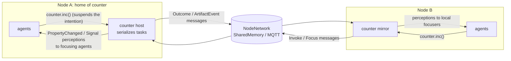

# Exploration: CArtAgO-style artifacts in JaKtA

Branch `feat/artifacts`, cut from `origin/main` at `bfc89dcc` (1.1.24).
This document covers four things:

- a reference summary of CArtAgO and the A&A meta-model;
- the parts of the JaKtA execution model that matter for environment programming;
- three designs with their trade-offs, and a recommendation;
- what the prototype on this branch covers, its limitations, and the open questions.

## TL;DR

- **An artifact lives on exactly one node, and that node is its workspace.** The node runner executes it like an agent.
  Under the hood, the artifact runs on an internal JaKtA agent whose goals are the tasks to execute: operations,
  internal operations, focus requests.
  - The agent's reasoning loop serializes those tasks, which gives CArtAgO's atomicity for free: one step at a time,
    and suspension points (`await`, `delay`) release the artifact.
  - Time, virtual time and cancellation behave exactly as they do for agents.
  - Invoking an operation from a plan (`counter.inc()`) suspends only the calling intention. It returns the result, or
    throws, and a throw becomes a plan failure.
- **Other nodes use the artifact through a mirror** (`node.mirrorArtifact(Counter("counter"))`).
  - The mirror is a local stand-in that forwards operations to the home node as messages over the existing
    `NodeNetwork`.
  - It republishes the artifact's events as *local perceptions*.
  - Agents write the same code whether the artifact is local or remote.
  - Nodes stay independent: the only cross-node traffic is messages, so it rides on `SharedMemoryNetwork` today and on
    the MQTT network of PR #962 once the protocol payloads are serializable.
- **The prototype changes nothing in `jakta-api`, `jakta-core`'s engine, the runners or the networks.**
  - It is about 310 lines in `jakta-core/src/commonMain/kotlin/it/unibo/jakta/artifact/`.
  - Its tests cover a shared counter, a tuple space with a blocking `take`, a clock with an internal operation on
    virtual time, an artifact used from another node, atomicity with agents running on 4 threads, and Prolog beliefs.
- **The main cost is that artifact hosts are agents under the hood.** They show up in `node.agents`, receive broadcasts,
  need a body (so for now they only work on `Node<Any>`), and count for node termination.
  - If that leak matters, the next step is to make artifacts first-class in the API (design C below).
  - That change keeps the user-facing API of the prototype.

---

## 1. CArtAgO and the A&A meta-model (reference)

Sources were checked as follows (the research was done by a sub-agent, and I spot-checked it):

- **Read in full:** the CArtAgO sources (`CArtAgO-lang/cartago` master, last commit 2022-04, `3.2-SNAPSHOT`, tags
  v2.5/v3.0/v3.1), the JaCaMo sources (`jacamo-lang/jacamo` v1.3.1, which uses CArtAgO 3.1), the
  *CArtAgO by example* guide, and the AAMAS'07, EMAS'18 and AAMAS'19 papers.
- **Abstract or blurb only:** the JAAMAS 2011 paper (Ricci, Piunti, Viroli), which is closed access, and the JaCaMo
  book (Boissier et al., MIT Press 2020). Claims attributed to them go no further than that.
- **Version skew:** the by-example guide targets CArtAgO 2.0/Jason 1.3 (2012), and CArtAgO 3.x changed workspaces a
  lot. The differences are pointed out below.

### 1.1 The meta-model

- **Agents and artifacts.** Agents are pro-active entities. Artifacts are passive, function-oriented entities that
  agents create, share, use and dispose of, e.g. resources and tools. "Differently from agents, artifacts are not
  meant to be autonomous or pro-active" [AAMAS07]. Omicini, Ricci, Viroli frame the same split in [JAAMAS08]: agents
  are pro-active, artifacts reactive.
- **Workspaces** are logical containers of artifacts. They define locality and topology: which artifacts an agent can
  use and observe [AAMAS07].
- **Usage interface** (the coffee-machine analogy):
  - *operations* are what agents trigger by acting;
  - *observable properties* are state perceived continuously;
  - *observable events (signals)* are transient.
- **Link interface.** These are operations meant to be called by other artifacts, for composition (`@LINK`).
- **Manual.** It has three parts: function description, usage interface description and operating instructions
  [AAMAS07]. In CArtAgO 3.x it is vestigial: the manual loading in `Artifact.bind()` is commented out.
- **Environment programming.** The environment is a first-class programmable abstraction, and artifacts encapsulate
  coordination, organisation and integration functions. This is the thesis of [JAAMAS11]; the formal operational model
  is in [ProMAS09].

### 1.2 Programming artifacts (CArtAgO Java API)

**Defining an artifact.** Subclass `cartago.Artifact`. `init(...)` receives the `makeArtifact` arguments, and
operations are `void` methods annotated `@OPERATION`. Everything is found by reflection and keyed by
**name/arity**, so overloading works by arity only.

```java
public class Counter extends Artifact {
  void init() { defineObsProperty("count", 0); }
  @OPERATION void inc() {
    ObsProperty p = getObsProperty("count");
    p.updateValue(p.intValue() + 1);
    signal("tick");
  }
}
```

**Observable properties** are tuples of any arity:

- `defineObsProperty(name, values...)`;
- `getObsProperty(name).updateValue(...)`;
- `removeObsProperty`;
- annotations are allowed.

**Signals.** `signal(type, args...)` goes to all observers; `signal(agentId, type, args...)` goes to one observer.

**Failure.** `failed(msg[, descr, args...])` aborts the operation. On the Jason side the failure shows as
`error_msg(Msg)` and `env_failure_reason(descr(...))`.

**Results** come back through `OpFeedbackParam<T>` output parameters (`set`/`get`). An unbound Jason variable is bound
when the operation succeeds.

**Guards and `await`.** There are two ways to wait:

- `@OPERATION(guard="g")` with a `@GUARD boolean g(...)` delays the *start* of an operation;
- `await("g", ...)` in the middle of an operation splits it into atomic steps.

`await_time(ms)` is the timed form. `await(IBlockingCmd)` runs blocking I/O with the lock released. Bounded buffer:

```java
@OPERATION(guard="notFull") void put(Object o) { items.add(o); getObsProperty("n").updateValue(items.size()); }
@OPERATION(guard="notEmpty") void get(OpFeedbackParam<Object> r) { r.set(items.remove(0)); ... }
```

**Internal operations.** `execInternalOp("count")` starts an `@INTERNAL_OPERATION` asynchronously. That is how an
artifact gets "internal behaviour" over time:

```java
@OPERATION void start() { if (!counting) { counting = true; execInternalOp("count"); } else failed("already_counting"); }
@INTERNAL_OPERATION void count() { while (counting) { signal("tick"); await_time(TICK_TIME); } }
```

**Linked operations.**

- Output ports are declared with `@ARTIFACT_INFO(outports=@OUTPORT(name="out-1"))`.
- Agents wire artifacts with `linkArtifacts(Id1, "out-1", Id2)`.
- The linking artifact calls `execLinkedOp("out-1", "inc")`. The call commits, releases the lock and blocks until the
  linked operation completes.

**External threads** (GUIs, callbacks) bracket their changes with `beginExtSession()`/`endExtSession()` in 3.x.
In 2.x the names were `beginExternalSession`/`endExternalSession`.

**Atomicity and visibility** (verified in the code):

- **One lock per artifact.** Each artifact has one *fair* `ReentrantLock`, so at most one operation step runs at a time.
- **Suspension releases the lock.** `await*` releases it.
- **Changes are buffered.** Property changes stay in a buffer until a *commit*, which happens:
  - at the end of an operation;
  - on `signal`;
  - on any `await*`;
  - on `execLinkedOp`;
  - on an explicit `commit()`;
  - on `endExtSession`.
- **Rollback is per step.** On failure only the uncommitted changes are rolled back, not the whole operation.
- **Guards are re-evaluated after every commit** (a `signalAll` wakes every waiter).

### 1.3 Workspaces

- **CArtAgO 2.x** has a flat set of workspaces per node, with a `default` one.
  - The node artifact offers `createWorkspace`, `joinWorkspace` and `joinRemoteWorkspace(name, address, ...)`.
  - The workspace artifact offers `makeArtifact`, `lookupArtifact`, `disposeArtifact`, `focus`, `stopFocus`,
    `focusWhenAvailable`, `linkArtifacts` and `quitWorkspace`.
  - Remote access goes over RMI (or LIPE-RMI), and network addresses leak into agent code.
- **CArtAgO 3.x** (JaCaMo ≥ 1.0):
  - Workspaces form a *tree* addressed by path (`/main/w1`).
  - Operations are split across three artifacts: `WorkspaceArtifact` (make, lookup, dispose, link), a per-agent
    session artifact (join, quit), and a per-agent-per-workspace body artifact (`focus`, `stopFocus`, `focusing(...)`).
  - Each workspace has default artifacts: `workspace`, `system`, `manrepo`, `console`, and `blackboard`, a tuple space
    with `out`/`in`/`rd` built on `await`.
  - Infrastructure layers are `web` (the default, Vert.x HTTP/WebSocket), `rmi` and `lipermi`.
  - A remote join goes through a local *facade* workspace that proxies over HTTP and gets notifications through
    callback IRIs [AAMAS19].
  - AAMAS'19 criticises the 2.x model as "a flat sea of (unrelated) workspaces", with network details exposed to agents.

### 1.4 Integration with Jason / JaCaMo

The bridge is `jaca.CAgentArch`, a Jason `AgArch` that listens to CArtAgO events.

**Actions become operations.**

- The action repertoire is the set of operations of the artifacts in the joined workspaces, one-to-one and dynamic.
- `act()` never blocks: the action is enqueued, and the *intention* stays suspended while the agent runs its other
  intentions.
- When the action completes it is bound or failed:
  - on success, unbound arguments are bound to the output parameters;
  - on failure, the plan fails with `error_msg`/`env_failure_reason` annotations.

**Targeting a specific artifact.** An action can carry an annotation:

- `[artifact_id(Id)]`;
- `[wsp(W)]`;
- `[artifact_name(N)]`, which only works together with `wsp`.

**Untargeted actions** are resolved by name/arity inside the current workspace, in this order:

1. an artifact the agent created;
2. otherwise one it focuses;
3. otherwise the first registered.

This is a known source of ambiguity: the JaCaMo tutorial warns that a message "is shown in an undetermined console".

**Percepts.**

- The agent arch drains an unbounded per-agent event queue at the *sensing* step.
- **Observable properties become beliefs**, updated as `-count(Old)` then `+count(New)`. They are annotated with
  `source(percept)`, `percept_type(obs_prop)`, `artifact_id`, `artifact_name` and `workspace`.
- **On focus**, the current snapshot is added.
- **Signals become events `+sig(...)`** (`percept_type(obs_ev)`). They are **not** stored as beliefs.
- Same-named properties from different artifacts get *mixed* into one belief with merged annotations.
- JaCaMo ≥ 0.6 adds namespaces: `ns::focus(A)` routes that artifact's percepts into namespace `ns`.

**Data binding.** Numbers become doubles, and other Java objects become opaque `cobj_N` atoms.

**Declarations in `.jcm` files.** For example:

```
workspace w { artifact c: pkg.Counter(10) { focused-by: bob } }
```

Agents can also declare `join: w` and `focus: w.c`. At launch, each agent gets a goal that joins, looks up and focuses
the artifacts, with retries.

### 1.5 Threading model (3.x)

- **Workers.** Each workspace has a bounded queue of operation frames (100) and a pool of `EnvironmentController`
  threads, one per CPU at first.
- **The pool grows.** It adds 10 threads at a time when all are busy, and the code sets no upper bound.
- **A suspended operation holds a thread.** Guard waits and `await_time` each keep an OS thread blocked.
- **Agents are fully asynchronous.** An operation completes on a worker thread, which pushes the completion, property
  and signal events into the agent's session queue. The agent consumes them at its next `perceive()`.

### 1.6 Later evolutions and other frameworks

**JaCaMo 1.x** uses CArtAgO 3.x. JaCaMo 1.0 is "the version to be used with the JaCaMo book" [MAOP20]. The book presents
three dimensions: agent, environment (which "allows the development of shared resources and connections to the real
world") and organisation.

**Hypermedia MAS** [EMAS18]: A&A projected onto the Web.

- Three principles: IRIs + RDF as a uniform resource space, a single entry point, and observability.
- **W3C WoT Thing Descriptions** describe artifact affordances.
- **Yggdrasil** is a Vert.x platform that serves A&A environments over HTTP, with WebSub for observation. Its
  `HypermediaTDArtifact`s declare affordances.
- **jacamo-hypermedia's `ThingArtifact`** wraps a TD with *generic* operations: `readProperty`, `writeProperty`,
  `invokeAction`.

**SARL.** The environment is a *Space* (`EventSpace`, custom `SpaceSpecification`s such as a physics space), reached
through capacities/skills. There are no artifacts.

**JADE.** It has no environment abstraction: shared resources are wrapped as agents or DF services.

**SPADE.** The `spade_artifact` plugin has artifacts with an async `run()` that publish observations over XMPP PubSub.
Agents `focus(jid, callback)`. It is observation only, with no operations.

**ASTRA.** Its CArtAgO module maps property changes and signals to explicit events (`$cpe`, `$cse`) and unknown
actions to operations.

**EIS** (Behrens, Hindriks, Dix, AMAI 2011) standardises the agent↔environment *boundary*:

- entities, `performAction` (synchronous), `getPercepts` (pull);
- one environment per MAS;
- no artifacts, workspaces, focus or signals.

### 1.7 Known limitations of CArtAgO

- **Java-only and reflection-heavy.** Operations are string- and arity-based.
- **Lossy data binding** with Jason (doubles, opaque objects).
- **Ambiguous** untargeted dispatch, and percept mixing across artifacts.
- **Thread-per-suspended-operation scalability.** The pool is unbounded, and a bounded queue whose `put()` blocks
  agents.
- **Distribution** was RMI with exposed addresses in 2.x. It is better in 3.x, but remote deployment from JCM is still
  "not implemented yet".
- **Dormant since 2022.** The guide still uses 2.x names.

References:

- **[AAMAS07]** Ricci, Viroli, Omicini, *Give agents their artifacts*, AAMAS 2007.
  <https://lia.disi.unibo.it/~ao/pubs/pdf/2007/aamas.pdf>
- **[JAAMAS08]** Omicini, Ricci, Viroli, *Artifacts in the A&A meta-model for multi-agent systems*, JAAMAS 17(3),
  2008. doi:10.1007/s10458-008-9053-x
- **[JAAMAS11]** Ricci, Piunti, Viroli, *Environment programming in multi-agent systems: an artifact-based
  perspective*, JAAMAS 23(2):158–192, 2011. doi:10.1007/s10458-010-9140-7
- **[ProMAS09]** Formal model of artifact-based environments.
  <https://apice.unibo.it/xwiki/bin/view/Publication/FormalAAPROMAS09>
- **[Guide]** *CArtAgO and JaCa by example*.
  <https://github.com/CArtAgO-lang/cartago/blob/master/docs/cartago_by_examples/cartago_by_examples.tex>
- **CArtAgO sources:**
  - `Artifact.java`: <https://github.com/CArtAgO-lang/cartago/blob/master/src/main/java/cartago/Artifact.java>
  - `Workspace.java`: <https://github.com/CArtAgO-lang/cartago/blob/master/src/main/java/cartago/Workspace.java>
  - `CAgentArch.java`: <https://github.com/CArtAgO-lang/cartago/blob/master/src/jaca/java/jaca/CAgentArch.java>
- **JaCaMo:**
  - JCM docs: <https://jacamo-lang.github.io/jacamo/jcm.html>
  - release notes: <https://jacamo-lang.github.io/jacamo/release-notes.html>
- **[AAMAS19]** Ricci et al., distributed workspaces as a resource hierarchy.
  <https://www.ifaamas.org/Proceedings/aamas2019/pdfs/p790.pdf>
- **[EMAS18]** Ciortea, Boissier, Ricci, *Engineering World-Wide Multi-Agent Systems with Hypermedia*, EMAS 2018.
  Yggdrasil: <https://github.com/Interactions-HSG/yggdrasil>. jacamo-hypermedia:
  <https://github.com/HyperAgents/jacamo-hypermedia>
- **[MAOP20]** Boissier, Bordini, Hübner, Ricci, *Multi-Agent Oriented Programming*, MIT Press, 2020.
- **Other frameworks:**
  - SARL spaces: <https://www.sarl.io/docs/official/lang/aop/Space.html>
  - SPADE artifacts: <https://spade-artifact.readthedocs.io/en/latest/usage.html>
  - EIS: <https://github.com/eishub/eis>

---

## 2. The JaKtA execution model, as far as artifacts are concerned

This section is from reading `jakta-api`, `jakta-core` and `jakta-dsl` on `main`, and the newer docs on the
`feat/doc-website-migration` branch (`website/docs/explanation/{execution-model,nodes,communication}.md`,
`how-to/{connect-environment,multi-node,custom-body}.md`).

**Nodes.**

- A MAS is a set of **nodes**, each hosting agents with **bodies**.
- The node delivers **perceptions** (`node.publishEvent(p, filter)`) directly to its own agents, and they **never
  leave the node**.
- **Messages** are `SystemEvent`s that travel through a `NodeNetwork`. Every node receives them and delivers them to
  its local agents that pass the filter.
- Agent additions and removals and shutdowns are system events as well.

**Runners and networks.**

- `CoroutineNodeRunner` subscribes each node to the network and forwards its system events. It starts one coroutine per
  agent, looping on `BaseAgentLifecycle.step()`.
- `SharedMemoryNetwork` broadcasts in-process, and delivers only to nodes that are already subscribed.
- The Alchemist incarnation steps agents from simulator actions (`tryStep`) with a simulated-time dispatcher.

**There is no environment object.** The environment is the user's Kotlin model:

- *skills* (objects put in scope with `context(...)`) act on it and publish perceptions;
- each agent maps perceptions to beliefs or goals with `handlesPerceptionEvents` (an `AgentUpdate`).

This is exactly where artifacts fit. Today, a shared model has **no concurrency discipline** (every skill is on its
own), **no subscription** (a perception goes to whoever the filter selects), and **no reach beyond its node**.

**One FIFO queue per agent.** Belief and goal events, intention steps and external events all go through it. Only
belief and goal events trigger plans. External events go through the handlers first. `agent.wait(filter)` sees every
event, external ones included.

**Intentions are coroutines on an `IntentionDispatcher`.**

- Resuming one enqueues a `Step` event, so plan bodies interleave only at suspension points.
- A suspended intention (`delay`, `achieve`, `wait`, or any `suspend` call) leaves the agent reactive.
- **This is exactly CArtAgO's "the intention waits for the operation, the agent does not"**, and it comes for free from
  `suspend` functions.

**Failure.** An exception in a plan body fails the goal, and `failing.goal { }` plans handle it. A thrown operation
failure maps onto this directly.

**Threads.**

- `IntentionDispatcher` requires the dispatcher it wraps to implement `Delay`. So **agents cannot run on
  `Dispatchers.Default`/`IO`**: the agent crashes with "must implement Delay", as I verified.
- In practice they run on an event loop (`runBlocking`, `runTest`, the Alchemist dispatcher), or on an executor-based
  dispatcher such as `Executors.newFixedThreadPool(n).asCoroutineDispatcher()`, which is truly parallel.
- Hence "atomic between suspension points" holds for free on a single event loop, but **not** on an executor
  dispatcher, where different agents run in parallel.

**Cancellation.**

- Intention jobs are children of a per-agent `SupervisorJob` that is not linked to the runner's coroutine.
- A removed agent's loop stops, so its intentions are never stepped again, and their `finally` blocks never run.
- **Any lock held by a removed agent's intention is never released.** This matters for design A below.

**Distribution** (PR #962, `feat/mqtt-messaging`, read-only):

- Each node runs in its own container, and nodes connect through MQTT.
- **Only `AgentMessage` system events cross the network**; everything else stays local.
- Payloads and filters must be `@Serializable` and registered in a `SerializersModule`.
- Message filters become serializable `MessageFilter`s (`SendTo`, `BroadcastFrom`), replacing the lambdas of `main`.
- Node and agent ids must be *stable*, because every container builds the whole MAS.
- `subscribe()` waits until all peers are online.
- A node also stops when its last agent is removed.

### Concept mapping

| A&A / CArtAgO | JaKtA (this prototype) |
|---|---|
| Workspace | **The node.** Artifacts are hosted by one node; agents of that node use them directly. |
| `joinRemoteWorkspace` / `lookupArtifact` | `node.mirrorArtifact(Counter("counter"))`: a local mirror that finds the home by artifact name |
| `makeArtifact` | `node.makeArtifact(Counter("counter"))`, at build time (tested) or from a plan (untested) |
| Operation (`@OPERATION`) | `val inc by operation { ... }` / `val add by operationWith { n: Int -> ... }`, called as `counter.inc()` from plans |
| `OpFeedbackParam` | The operation's return value |
| `failed(...)` → plan failure | Throwing in the operation → exception in the caller → plan failure → `failing.goal { }` |
| Observable property | `var count by observable(0)` → `ArtifactEvent.PropertyChanged` perception → belief via `handlesPerceptionEvents` |
| Signal | `signal("tick", value)` → `ArtifactEvent.Signal` perception → typically a goal (event-like) or `agent.wait` |
| `focus` / `stopFocus` | `agent.focus(counter)` / `agent.stopFocus(counter)`; focus replays the current values |
| Guard / `await` / `await_time` | `await { condition }` / `delay(...)` inside an operation |
| `execInternalOp` | `internalOperation { ... }` |
| One lock per artifact | One host loop per artifact (an internal agent): tasks interleave only at suspension points |
| `execLinkedOp` | An operation calls another artifact's operation (just a `suspend` call; untested) |
| Manual | Not modelled (the Kotlin class and KDoc are the manual) |

---

## 3. Designs

All three designs share the user-facing model sketched above. They differ in **where operation code runs** and **how
remote use works**.

### A. Artifact as a synchronized skill

The artifact is a plain object captured by plans, like today's skills. Operations are `suspend` functions that run
**on the caller's intention** under a per-artifact `Mutex`. `await` releases the mutex and waits for a change.
Properties and signals are published with `node.publishEvent` to the focusing agents.

**Pros:**

- It is the smallest design, with no extra entity.
- It is fully typed.
- An operation costs no event hops.

**Cons:**

- **Internal operations have no home.** User code has no node-level scope. A clock started by an agent runs on that
  agent's intention and dies with it, and on Alchemist it would need the agent's dispatcher anyway.
- **Removing an agent can freeze the artifact.** If a removed agent's intention holds the mutex (e.g. across a `delay`
  in an operation), the lock is never released (see Cancellation above).
- **Artifact state is touched on the callers' threads.** On an executor dispatcher, correctness then depends entirely
  on the mutex discipline.
- **Remote use needs a second mechanism.** Callers on other nodes would need to exchange messages and handle replies.
  Their events would arrive as messages, not perceptions, so agent code would differ by location.

### B. Artifact hosted as an internal agent, with mirrors on other nodes (prototype)

`node.makeArtifact(a)` adds an agent to the node, whose body is the artifact:

- its goals are `ArtifactTask`s;
- its single plan runs them.

**Running work on the host.** Invoking an operation (or `focus`) posts a task with `host.alsoAchieve(task)` and
suspends the caller on a `CompletableDeferred` until the host completes it. `internalOperation` posts a task too.
`await` suspends the task on a `StateFlow` that is bumped after every step and every property change.

**Mirrors.** `node.mirrorArtifact(a)` adds the same kind of host in *mirror* mode:

- it forwards operations to the home host as messages, and waits for the reply with `wait`;
- it sends one `Focus` message to subscribe;
- it republishes the events it receives as local perceptions to its own focusers.

The home host's id is derived from the artifact name, `BaseAgentID(name, "artifact:<name>")`, so no discovery is
needed.

**Pros:**

- It changes **nothing** in the API, the engine, the runners or the networks.
- **Atomicity** is what the agent reasoning cycle already provides. It holds even with parallel agents, and I tested
  it on 4 threads.
- **Time and virtual time** work as they do for agents.
- On Alchemist, hosts registered at build time go through the same `AgentAddition` path as the initial agents
  (untested, and `JaktaForAlchemistRuntime` carries a TODO saying it is probably broken since the latest runner
  changes).
- Removing a caller cannot corrupt the artifact.
- Agent code is the same for local and remote artifacts.

**Cons:**

- **The host is visible as an agent.** It is in `node.agents`, it receives broadcasts (and ignores them), it needs a
  body (so it only works on `Node<Any>`), and it counts as an agent for termination.
- **Every operation costs a few event hops**, and a remote one costs two network messages.
- **Remote operations are dispatched by name**, with untyped arguments on the wire. The call site stays typed because
  every node has the artifact class.

### C. First-class artifacts in the runtime

Add `ExecutableArtifact` to `jakta-api`, next to agents in `Node`, and teach every runner to step artifacts (Coroutine,
the test `ManualStepNodeRunner`, and Alchemist actions). Add artifact system events (`ArtifactOperation`,
`ArtifactFocus`, `ArtifactEvent`) that networks carry. The MQTT wire format would carry them too.

**Pros:**

- The model is clean: a node has agents *and* artifacts.
- There is no body hack.
- It opens the door to explicit termination semantics, fast paths, and discovery through manuals or Thing Descriptions.

**Cons:**

- It touches the API, every runner and every network, including the MQTT serialization.
- It is the biggest change, and B already shows the semantics it would implement.

### Where an artifact lives, concretely

**In one node.** That node is the artifact's workspace, and its runner executes it. There is no shared-memory sharing
across nodes, not even with `SharedMemoryNetwork`: the mirror path uses messages only, so the same code works when
distributed.

**"Its own node-like runnable."** An *environment node* hosting only artifacts is already expressible with B
(`node { node.makeArtifact(...) }`). It needs a termination policy, because nobody terminates it (see limitations).

### Recommendation

**Adopt B's user model and semantics now. Move the host to C only if the "hosts are agents" leak turns out to matter.**

The prototype shows that artifacts fit the independent-nodes model without touching it:

- an artifact is one more *participant* that the node runner executes;
- it interacts with local agents through the two channels agents already have: suspending calls inside plans, and
  perceptions;
- it interacts with other nodes only through messages.

The user-facing API would stay the same under C: `Artifact`, `observable`, `operation`, `makeArtifact`,
`mirrorArtifact`, `focus`.



```mermaid
sequenceDiagram
  participant P as Plan on node B
  participant M as Mirror (node B)
  participant N as NodeNetwork
  participant H as Host (node A)
  P->>M: counter.inc() - alsoAchieve(task); P's intention suspends
  M->>N: Message(Invoke("inc", Unit, 7)) to artifact:counter
  N->>H: delivered by node A
  H->>H: task runs inc (atomic step), count = 1
  H-->>N: Message(PropertyChanged(count, 1)) to focusing mirrors
  H-->>N: Message(Outcome(7, 1, null)) to the mirror
  N->>M: PropertyChanged, published as a perception to node B's focusers
  N->>M: Outcome; the mirror's wait resumes
  M->>P: result 1; the intention resumes
```

---

## 4. The prototype

It lives in `jakta-core`, package `it.unibo.jakta.artifact`, next to the other environment-support code (skills). It
uses only the public API and core's `agent { }` DSL, so moving it to its own module later is a mechanical change.

- `jakta-core/src/commonMain/kotlin/it/unibo/jakta/artifact/Artifact.kt` holds `Artifact`, `Operation`,
  `ArtifactEvent` and the internal protocol (`Invoke`, `Outcome`, `Focus`).
- `jakta-core/src/commonMain/kotlin/it/unibo/jakta/artifact/ArtifactHosting.kt` holds `Node<Any>.makeArtifact`,
  `Node<Any>.mirrorArtifact`, `Agent.focus` / `Agent.stopFocus`, and the host agent.

### Defining and using an artifact

```kotlin
class Counter(name: String) : Artifact(name) {
    var count by observable(0)                  // observable property "count"
    val inc by operation {                      // operation "inc": returns the new count
        count++
        if (count == 3) signal("three")
        count
    }
    val dec by operation { check(count > 0) { "count is already 0" }; count-- }   // may fail
}

class TupleSpace(name: String) : Artifact(name) {
    private val tuples = mutableListOf<String>()
    val write by operationWith { tuple: String -> tuples += tuple }
    val take by operationWith { prefix: String ->                                 // blocking "in"
        await { tuples.any { it.startsWith(prefix) } }
        tuples.first { it.startsWith(prefix) }.also { tuples -= it }
    }
}

class Clock(name: String) : Artifact(name) {
    val start by operation {
        internalOperation { for (tick in 1..3) { delay(1.seconds); signal("tick", tick) } }
    }
}
```

```kotlin
mas(NodeBuilders.baseNode<Any>()) {
    node {
        val counter = node.makeArtifact(Counter("counter"))
        agent<String, String>(BaseAgentID("user")) {
            embodiedAs { Any() }
            handlesPerceptionEvents { e ->                     // the incarnation decides what a percept is
                when (e) {
                    is ArtifactEvent.PropertyChanged -> AgentUpdate.Belief(
                        setOf("${e.property}(${e.value})"),
                        beliefs.filter { it.startsWith("${e.property}(") }.toSet(),
                    )
                    is ArtifactEvent.Signal -> AgentUpdate.Goal(setOf(e.signal))
                    else -> null
                }
            }
            hasInitialGoals { !"use" }
            hasPlanLibrary {
                adding.goal { ifGoalMatch("use") } triggers {
                    agent.focus(counter)
                    val n = counter.inc()                      // suspends this intention only
                }
            }
        }
    }
    node {
        val counter = node.mirrorArtifact(Counter("counter")) // the one hosted by the first node
        // ... identical agent code
    }
}.run(CoroutineNodeRunner(SharedMemoryNetwork()))
```

### How the DSL is shaped

- **Names come from the Kotlin properties.** `by observable(...)` and `by operation { }` take their names from the
  property (`provideDelegate`), so no names are repeated. Remote dispatch then only needs those names.
- **One argument uses a separate name.** Operations with one argument use `operationWith { a: A -> }`. Kotlin
  cannot resolve an overload between `suspend () -> R` and `suspend (A) -> R` for a lambda without parameters (I tried
  it). Several arguments go in a data class or a `Pair`.
- **Operations are values.** They are `Operation<A, R>` values with a `suspend operator fun invoke`, so the call site
  reads like a method call and is typed. Operations can be called from anywhere that can suspend, including from
  another artifact's operation (that gives linking, untested).
- **`focus` is an extension on `Agent`, like `sendTo`.** Hence `agent.focus(counter)`: the artifact needs the
  caller's id.
- **The core is incarnation-agnostic.**
  - Artifacts produce plain Kotlin events (`ArtifactEvent`), and each agent maps them in `handlesPerceptionEvents`.
  - In the string incarnation the mapping is `"count(3)"`. In the Prolog one it is
    `count(3)[artifact_name(counter)]`, like JaCaMo: see `TestPrologArtifacts`.
  - Signals map best to goals. JaKtA plans are only triggered by belief and goal events, and a belief set would
    swallow a repeated signal.
  - Alchemist is untested, but hosts are ordinary agents to it: see the limitations.

### Tests

**`jakta-core/src/commonTest/.../artifact/TestArtifacts.kt`** (runs on the JVM, JS and Linux native, on `runTest`
virtual time):

- `twoAgentsShareACounterOnTheSameNode`: one agent focuses and observes 0, 1, 2, 3, and terminates on the `three`
  signal. The other agent gets the return values 1, 2, 3. A failing `dec` is handled by a `failing.goal` plan.
- `awaitSuspendsOnlyTheCallerIntention`: `take("job")` blocks the consumer's intention. Its other intention runs
  meanwhile. The consumer then receives `job-1`, skipping the non-matching tuple.
- `internalOperationsRunOnTheNodeTime`: the clock's ticks arrive at virtual times 1000, 2000 and 3000 ms.
- `agentsOnAnotherNodeUseTheArtifactThroughAMirror`: the artifact is hosted on node A and used from node B. Both
  nodes' focusers observe 0, 1, 2. Return values cross the network, and the failure message `"count is already 0"`
  crosses the network too.

**`jakta-core/src/jvmTest/.../artifact/TestArtifactThreads.kt`**: 4 agents on a 4-thread pool call `inc` 250 times
each. Every call must see a distinct count from 1 to 1000.

- As a check that the test works, I made operations run on the caller instead of the host. Increments were then lost
  and the test failed with a timeout. That change was reverted.

**`jakta-prolog-incarnation/src/commonTest/.../TestPrologArtifacts.kt`**: properties become Prolog facts annotated with
`artifact_name`, and plans match them.

Run them with:

```
./gradlew :jakta-core:jvmTest --tests 'it.unibo.jakta.artifact.*' :jakta-prolog-incarnation:jvmTest --tests 'it.unibo.jakta.TestPrologArtifacts'
```

---

## 5. Known limitations of the prototype

**Hosts are agents** (the cost of design B):

- They only work on `Node<Any>`: the host's body is the artifact.
- They appear in `node.agents` and receive broadcasts (they ignore them).
- They keep a node alive in the MQTT branch's "stop when the last agent is removed" rule.
- No termination policy exists for nodes that only host artifacts.

**Remote use:**

- **Startup race on `SharedMemoryNetwork`.** A message is lost if the destination node has not subscribed yet. This is
  a pre-existing problem for all messages, and `MqttNetwork` solves it by waiting for its peers.
- **Callers hang if the home dies.** Nothing reports that a host was removed or its node terminated, so operations
  waiting on it never complete, and neither do mirrors. Callers can wrap calls in `withTimeout`.
- **Only the message of a remote failure crosses the network.** It becomes an `IllegalStateException`; the exception
  type is lost.
- **Not wired to MQTT yet.** That needs:
  - `@Serializable` versions of `Invoke`/`Outcome`/`Focus`/`ArtifactEvent`, plus the user's argument and result types,
    in the `SerializersModule`;
  - `SendTo(receiver)` in place of the lambda filters (the PR changes `publishEvent`'s signature).

  Artifact names are already stable ids, which is what MQTT needs.
- **Argument aliasing in-process.** On `SharedMemoryNetwork`, arguments and results are passed by reference, so
  mutable objects are shared between nodes.

**Visibility differs from CArtAgO.** Each assignment of an observable property is published immediately, so
`count++; count++` produces two events. CArtAgO buffers changes and commits at the end of the step. The steps are still
atomic, and publishing at the end of each step would be a small change (see the open questions).

**Unsynchronized direct reads.** Plans *can* read `counter.count` directly, bypassing the host.

- The read is unsynchronized on executor dispatchers.
- On a mirror it returns the last mirrored value.
- Agents are meant to use beliefs.

**Not implemented:**

- `stopFocus` keeps the beliefs derived from the artifact.
- No per-agent signals.
- No operation *start* guards, other than calling `await` first.
- No `disposeArtifact`, manuals, typed remote exceptions, or multiple workspaces per node.
- Artifact names are global to the MAS.

**Untested:**

- linked operations (an operation calling another artifact);
- `ManualStepNodeRunner`;
- Alchemist. Hosts are agents, so build-time artifacts should be scheduled like initial agents. Runtime
  `makeArtifact` shares the fate of runtime `addAgent` there, and `JaktaForAlchemistRuntime` has a TODO about it.

---

## 6. Open questions for the user

I picked a default for each of these, marked *(default)*.

1. **B or C?** Is it acceptable that artifact hosts are agents under the hood? *(default: yes for now, C later)*
   Would you rather make artifacts first-class in `Node` and the runners?
2. **Module.** Should artifacts live inside `jakta-core` *(default)*, or in their own `jakta-artifacts` module?
3. **Workspaces.** Is one node = one workspace enough *(default)*, or do you want named workspaces inside a node?
   Should artifact names be global *(default)* or namespaced by node id? The latter needs stable `NodeID`s, as in
   PR #962.
4. **Property visibility.** Publish on every assignment *(default, simplest)*, or commit at the end of each step like
   CArtAgO?
5. **Signals.** Map signals to goals by convention *(default, in the tests)*, or add a plan trigger for external
   events in the engine? JaKtA plans can only react to beliefs and goals.
6. **Default percept mappings per incarnation.** Should incarnations offer a default mapping from artifact events to
   beliefs? An example is a helper in the Prolog incarnation producing
   `prop(V)[artifact_name(A), source(percept)]`. *(default: none, users write the mapping)*
7. **Distribution.** Should the artifact protocol ride on messages *(default)*, or be its own system event? PR #962
   only carries `AgentMessage`s, so messages work there once serializable. Should the MQTT work land first, so the
   artifact protocol is written against `MessageFilter` and kotlinx.serialization directly?
8. **Failure of a host.** Should callers and mirrors be notified, or fail, when an artifact's host or home node goes
   away? This needs a small runner change, or timeouts.
