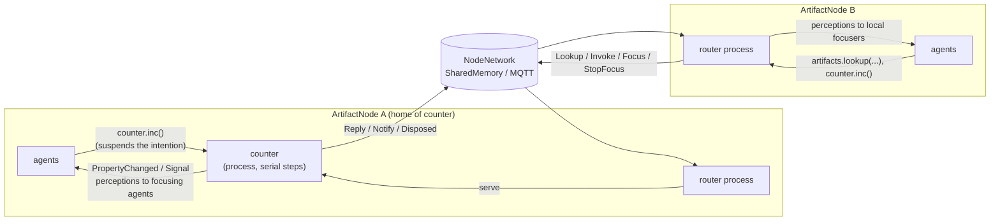
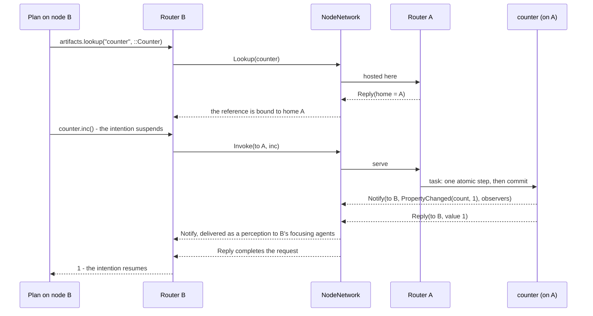

# Exploration: CArtAgO-style artifacts in JaKtA

Branch `feat/artifacts`, cut from `origin/main` at `bfc89dcc` (1.1.24). This is the second iteration (v2).
The first one hosted artifacts on internal agents. The user's review asked for four changes:

- artifacts must not be agents;
- agents use artifacts through skills;
- artifacts live in a dedicated module;
- go deeper on distribution, failures and CArtAgO's semantics.

This document covers:

- what changed in v2, and why;
- a reference summary of CArtAgO and the A&A meta-model;
- the parts of the JaKtA execution model that matter for environment programming;
- the designs considered, and the one implemented;
- the `jakta-artifacts` module, its tests, the current limitations and the open questions.

The work is aligned with issue #887, "Environment Interaction and 'Artifacts' Active Behavior":

- environment stubs in an optional module;
- active behaviour that runs independently of agents (e.g. polling a sensor);
- something that scales to distributed deployments;
- native support for shared distributed environments.

## TL;DR

**Core gains one general extension point: node processes.** `node.launchProcess { ... }` runs a suspending process
alongside the node's agents, on the dispatcher the runner uses for the node, and cancels it when the node terminates.

- It is the "active behaviour" of #887. A sensor-polling test is in core.
- It is how artifacts run.
- It takes 26 lines in 4 files of `jakta-api`/`jakta-core`, and nothing else in core changes.

**Artifacts live in the new `jakta-artifacts` module** and are not agents:

- `Artifact` is the base class: observable properties, operations, signals, `await`, internal operations.
- `ArtifactNode` is a node that hosts artifacts as node processes (`node.makeArtifact(...)`). It is the
  workspace. It handles the artifact messages arriving from the node network instead of delivering them to agents.
- `ArtifactSkill` is the agent side, installed with `context(ArtifactSkill(node)) { agent { ... } }`. Plan bodies
  then read:
  - `val counter = artifacts.lookup("counter", ::Counter)`
  - `agent.focus(counter)`
  - `counter.inc()`
  - `agent.stopFocus(counter)`
  - `agent.awaitSignal(clock, "done")`
- Whether the artifact is local or on another node is decided by the skill and the node, not by the plan.

**Atomicity follows CArtAgO.**

- Each artifact runs its coroutines on a serial view of the node dispatcher (`limitedParallelism(1)`), so they
  interleave only at suspension points.
- A *step* is the code between two suspension points. Steps are atomic, even with agents running in parallel on
  4 threads (tested).
- Changes to observable properties are committed at the end of each step and before each signal.
- A failed operation rolls back its uncommitted changes.

**Distribution rides on the existing node network**, with no host agents:

- a lookup is broadcast, and the home node replies;
- operations and focus requests then go as request/reply messages addressed to the home node;
- artifact events are sent to the nodes of remote observers, which deliver them as *local perceptions*.

**Failures:**

- A remote operation that fails throws an `ArtifactException` carrying the original message.
- When the home node terminates itself, it disposes its artifacts first:
  - remote observers perceive the removal of the properties;
  - pending and later remote calls fail.
- **Not detected:** crashes, and terminations requested by another node. They are the main open problem.

**Tests.**

- `jakta-artifacts` has 9 tests. 7 are common, and they pass on JVM, JS and Linux native. The other 2 are JVM-only:
  the multi-threaded atomicity test and Prolog.
- `jakta-core` has a new process test.

---

## v2: what changed and why

| Requirement | v1 | v2 |
|---|---|---|
| Artifacts are not agents | Each artifact was run by an internal agent (its goals were the tasks), so it showed up in `node.agents`, received broadcasts, needed a body (`Node<Any>` only) and counted as an agent for node termination | Each artifact is a **node process** with its own serial dispatcher. `node.agents` only contains agents (asserted in a test), broadcasts never reach artifacts, any body type works, and processes are cancelled with the node instead of keeping it alive |
| Agent side through skills | Free functions plus artifact references captured by plans | `ArtifactSkill(node)` installed with `context(...)`. It offers `make`, `lookup`, `focus`, `stopFocus` and `awaitSignal`, following the `MessagingSkill` pattern (member extensions plus `context(skill)` top-level functions, and a `PlanScope.artifacts` property like `blocksWorld`) |
| Dedicated module | Package inside `jakta-core` | `jakta-artifacts`, depending on `jakta-api`/`jakta-dsl`/`jakta-core`. The core diff is node processes only (see below) |
| Remote without host agents | A mirror agent per node forwarded requests | `ArtifactNode` overrides `handleExternalEvent`: messages whose payload is an artifact protocol message go to its *router* process instead of to agents. Requests are addressed to the home node found by lookup |
| Failure of the home node | Callers hung forever | Graceful self-termination of the home node broadcasts `Disposed`. Observers perceive `PropertyRemoved`, and pending and later calls throw `ArtifactException`. Crashes are still not detected (limitations) |
| `stopFocus` cleanup | Beliefs were kept | `stopFocus` delivers `PropertyRemoved` for every property before returning, locally and remotely. The agent's perception handler removes the beliefs, as `-count(V)` in Jason |
| Property publishing | Published on every assignment | CArtAgO semantics: changes are committed at the end of each step and before a `signal`, and rolled back if the operation fails. `count++; count++` is perceived as one change (tested) |
| Signals and an engine trigger | Mapped to goals by convention | Same conclusion, now argued (see §4): **no engine trigger is needed.** `ArtifactSkill.awaitSignal` covers waiting for a signal inside a plan |

### Changes to `jakta-api` / `jakta-core`, and why

`git diff origin/main..HEAD -- jakta-api jakta-core/src/commonMain` touches 4 files, +26 lines, no deletions:

1. **`Node.launchProcess(process: suspend () -> Unit)`** (api) is the one capability the module cannot build
   itself. Non-agent code has no other way to run on the node's runner:
   - on its dispatcher, so that `delay` follows virtual time in tests and the runner's time in general;
   - in its lifecycle, cancelled when the node terminates.

   Artifacts need it for operations, internal operations and timers. #887 asks for it directly ("processes that run
   independently of agents, such as polling a sensor"). It is general: core knows nothing about artifacts.
2. **`ExecutableNode.processes: EventStream<suspend () -> Unit>`** (api) is the runner-facing stream of launched
   processes. It follows the same pattern as `systemEvents`.
3. **`BaseNode`** (core) queues processes in an `UnlimitedChannelQueue`, like system events. A process launched
   before the node runs is started when it runs.
4. **`CoroutineNodeRunner`** (core) gets one more loop. It launches each process in the node's `supervisorScope`, so
   the existing `stopNode` cancels processes together with agents.

Alternatives I rejected:

- **A `NodeRunner` decorator in the module.** It changes nothing in core, but it does not compose with `runLocally()`
  or with PR #962's `runDistributed`.
- **Capturing the runner's coroutine context inside `systemEvents.next()`.** It works, but it is a hack.
- **A new `SystemEvent` subtype.** The sealed hierarchy would break exhaustive `when`s in other runners, and
  system events get broadcast over the network.

**What is not changed:**

- `ManualStepNodeRunner` (core tests) and the Alchemist incarnation ignore processes, so artifacts do not run there
  (see the limitations).
- Routing needs no core change. `ArtifactNode` extends `BaseNode` and overrides `handleExternalEvent` and
  `terminateNode`, which are already open.

---

## 1. CArtAgO and the A&A meta-model (reference)

Sources were checked as follows (the research was done by a sub-agent, and I spot-checked it):

- **Read in full:** the CArtAgO sources (`CArtAgO-lang/cartago` master, last commit 2022-04, `3.2-SNAPSHOT`, tags
  v2.5/v3.0/v3.1), the JaCaMo sources (`jacamo-lang/jacamo` v1.3.1, which uses CArtAgO 3.1), the
  *CArtAgO by example* guide, and the AAMAS'07, EMAS'18 and AAMAS'19 papers.
- **Abstract or blurb only:** the JAAMAS 2011 paper (Ricci, Piunti, Viroli), which is closed access, and the JaCaMo
  book (Boissier et al., MIT Press 2020). Claims attributed to them go no further than that.
- **Version skew:** the by-example guide targets CArtAgO 2.0/Jason 1.3 (2012), and CArtAgO 3.x changed workspaces a
  lot. The differences are pointed out below.

### 1.1 The meta-model

- **Agents and artifacts.** Agents are pro-active entities. Artifacts are passive, function-oriented entities that
  agents create, share, use and dispose of, e.g. resources and tools. "Differently from agents, artifacts are not
  meant to be autonomous or pro-active" [AAMAS07]. Omicini, Ricci, Viroli frame the same split in [JAAMAS08]: agents
  are pro-active, artifacts reactive.
- **Workspaces** are logical containers of artifacts. They define locality and topology: which artifacts an agent can
  use and observe [AAMAS07].
- **Usage interface** (the coffee-machine analogy):
  - *operations* are what agents trigger by acting;
  - *observable properties* are state perceived continuously;
  - *observable events (signals)* are transient.
- **Link interface.** These are operations meant to be called by other artifacts, for composition (`@LINK`).
- **Manual.** It has three parts: function description, usage interface description and operating instructions
  [AAMAS07]. In CArtAgO 3.x it is vestigial: the manual loading in `Artifact.bind()` is commented out.
- **Environment programming.** The environment is a first-class programmable abstraction, and artifacts encapsulate
  coordination, organisation and integration functions. This is the thesis of [JAAMAS11]; the formal operational model
  is in [ProMAS09].

### 1.2 Programming artifacts (CArtAgO Java API)

**Defining an artifact.** Subclass `cartago.Artifact`. `init(...)` receives the `makeArtifact` arguments, and
operations are `void` methods annotated `@OPERATION`. Everything is found by reflection and keyed by
**name/arity**, so overloading works by arity only.

```java
public class Counter extends Artifact {
  void init() { defineObsProperty("count", 0); }
  @OPERATION void inc() {
    ObsProperty p = getObsProperty("count");
    p.updateValue(p.intValue() + 1);
    signal("tick");
  }
}
```

**Observable properties** are tuples of any arity:

- `defineObsProperty(name, values...)`;
- `getObsProperty(name).updateValue(...)`;
- `removeObsProperty`;
- annotations are allowed.

**Signals.** `signal(type, args...)` goes to all observers; `signal(agentId, type, args...)` goes to one observer.

**Failure.** `failed(msg[, descr, args...])` aborts the operation. On the Jason side the failure shows as
`error_msg(Msg)` and `env_failure_reason(descr(...))`.

**Results** come back through `OpFeedbackParam<T>` output parameters (`set`/`get`). An unbound Jason variable is bound
when the operation succeeds.

**Guards and `await`.** There are two ways to wait:

- `@OPERATION(guard="g")` with a `@GUARD boolean g(...)` delays the *start* of an operation;
- `await("g", ...)` in the middle of an operation splits it into atomic steps.

`await_time(ms)` is the timed form. `await(IBlockingCmd)` runs blocking I/O with the lock released. Bounded buffer:

```java
@OPERATION(guard="notFull") void put(Object o) { items.add(o); getObsProperty("n").updateValue(items.size()); }
@OPERATION(guard="notEmpty") void get(OpFeedbackParam<Object> r) { r.set(items.remove(0)); ... }
```

**Internal operations.** `execInternalOp("count")` starts an `@INTERNAL_OPERATION` asynchronously. That is how an
artifact gets "internal behaviour" over time:

```java
@OPERATION void start() { if (!counting) { counting = true; execInternalOp("count"); } else failed("already_counting"); }
@INTERNAL_OPERATION void count() { while (counting) { signal("tick"); await_time(TICK_TIME); } }
```

**Linked operations.**

- Output ports are declared with `@ARTIFACT_INFO(outports=@OUTPORT(name="out-1"))`.
- Agents wire artifacts with `linkArtifacts(Id1, "out-1", Id2)`.
- The linking artifact calls `execLinkedOp("out-1", "inc")`. The call commits, releases the lock and blocks until the
  linked operation completes.

**External threads** (GUIs, callbacks) bracket their changes with `beginExtSession()`/`endExtSession()` in 3.x.
In 2.x the names were `beginExternalSession`/`endExternalSession`.

**Atomicity and visibility** (verified in the code):

- **One lock per artifact.** Each artifact has one *fair* `ReentrantLock`, so at most one operation step runs at a time.
- **Suspension releases the lock.** `await*` releases it.
- **Changes are buffered.** Property changes stay in a buffer until a *commit*, which happens:
  - at the end of an operation;
  - on `signal`;
  - on any `await*`;
  - on `execLinkedOp`;
  - on an explicit `commit()`;
  - on `endExtSession`.
- **Rollback is per step.** On failure only the uncommitted changes are rolled back, not the whole operation.
- **Guards are re-evaluated after every commit** (a `signalAll` wakes every waiter).

### 1.3 Workspaces

- **CArtAgO 2.x** has a flat set of workspaces per node, with a `default` one.
  - The node artifact offers `createWorkspace`, `joinWorkspace` and `joinRemoteWorkspace(name, address, ...)`.
  - The workspace artifact offers `makeArtifact`, `lookupArtifact`, `disposeArtifact`, `focus`, `stopFocus`,
    `focusWhenAvailable`, `linkArtifacts` and `quitWorkspace`.
  - Remote access goes over RMI (or LIPE-RMI), and network addresses leak into agent code.
- **CArtAgO 3.x** (JaCaMo ≥ 1.0):
  - Workspaces form a *tree* addressed by path (`/main/w1`).
  - Operations are split across three artifacts: `WorkspaceArtifact` (make, lookup, dispose, link), a per-agent
    session artifact (join, quit), and a per-agent-per-workspace body artifact (`focus`, `stopFocus`, `focusing(...)`).
  - Each workspace has default artifacts: `workspace`, `system`, `manrepo`, `console`, and `blackboard`, a tuple space
    with `out`/`in`/`rd` built on `await`.
  - Infrastructure layers are `web` (the default, Vert.x HTTP/WebSocket), `rmi` and `lipermi`.
  - A remote join goes through a local *facade* workspace that proxies over HTTP and gets notifications through
    callback IRIs [AAMAS19].
  - AAMAS'19 criticises the 2.x model as "a flat sea of (unrelated) workspaces", with network details exposed to agents.

### 1.4 Integration with Jason / JaCaMo

The bridge is `jaca.CAgentArch`, a Jason `AgArch` that listens to CArtAgO events.

**Actions become operations.**

- The action repertoire is the set of operations of the artifacts in the joined workspaces, one-to-one and dynamic.
- `act()` never blocks: the action is enqueued, and the *intention* stays suspended while the agent runs its other
  intentions.
- When the action completes it is bound or failed:
  - on success, unbound arguments are bound to the output parameters;
  - on failure, the plan fails with `error_msg`/`env_failure_reason` annotations.

**Targeting a specific artifact.** An action can carry an annotation:

- `[artifact_id(Id)]`;
- `[wsp(W)]`;
- `[artifact_name(N)]`, which only works together with `wsp`.

**Untargeted actions** are resolved by name/arity inside the current workspace, in this order:

1. an artifact the agent created;
2. otherwise one it focuses;
3. otherwise the first registered.

This is a known source of ambiguity: the JaCaMo tutorial warns that a message "is shown in an undetermined console".

**Percepts.**

- The agent arch drains an unbounded per-agent event queue at the *sensing* step.
- **Observable properties become beliefs**, updated as `-count(Old)` then `+count(New)`. They are annotated with
  `source(percept)`, `percept_type(obs_prop)`, `artifact_id`, `artifact_name` and `workspace`.
- **On focus**, the current snapshot is added.
- **Signals become events `+sig(...)`** (`percept_type(obs_ev)`). They are **not** stored as beliefs.
- Same-named properties from different artifacts get *mixed* into one belief with merged annotations.
- JaCaMo ≥ 0.6 adds namespaces: `ns::focus(A)` routes that artifact's percepts into namespace `ns`.

**Data binding.** Numbers become doubles, and other Java objects become opaque `cobj_N` atoms.

**Declarations in `.jcm` files.** For example:

```text
workspace w { artifact c: pkg.Counter(10) { focused-by: bob } }
```

Agents can also declare `join: w` and `focus: w.c`. At launch, each agent gets a goal that joins, looks up and focuses
the artifacts, with retries.

### 1.5 Threading model (3.x)

- **Workers.** Each workspace has a bounded queue of operation frames (100) and a pool of `EnvironmentController`
  threads, one per CPU at first.
- **The pool grows.** It adds 10 threads at a time when all are busy, and the code sets no upper bound.
- **A suspended operation holds a thread.** Guard waits and `await_time` each keep an OS thread blocked.
- **Agents are fully asynchronous.** An operation completes on a worker thread, which pushes the completion, property
  and signal events into the agent's session queue. The agent consumes them at its next `perceive()`.

### 1.6 Later evolutions and other frameworks

**JaCaMo 1.x** uses CArtAgO 3.x. JaCaMo 1.0 is "the version to be used with the JaCaMo book" [MAOP20]. The book presents
three dimensions: agent, environment (which "allows the development of shared resources and connections to the real
world") and organisation.

**Hypermedia MAS** [EMAS18]: A&A projected onto the Web.

- Three principles: IRIs + RDF as a uniform resource space, a single entry point, and observability.
- **W3C WoT Thing Descriptions** describe artifact affordances.
- **Yggdrasil** is a Vert.x platform that serves A&A environments over HTTP, with WebSub for observation. Its
  `HypermediaTDArtifact`s declare affordances.
- **jacamo-hypermedia's `ThingArtifact`** wraps a TD with *generic* operations: `readProperty`, `writeProperty`,
  `invokeAction`.

**SARL.** The environment is a *Space* (`EventSpace`, custom `SpaceSpecification`s such as a physics space), reached
through capacities/skills. There are no artifacts.

**JADE.** It has no environment abstraction: shared resources are wrapped as agents or DF services.

**SPADE.** The `spade_artifact` plugin has artifacts with an async `run()` that publish observations over XMPP PubSub.
Agents `focus(jid, callback)`. It is observation only, with no operations.

**ASTRA.** Its CArtAgO module maps property changes and signals to explicit events (`$cpe`, `$cse`) and unknown
actions to operations.

**EIS** (Behrens, Hindriks, Dix, AMAI 2011) standardises the agent↔environment *boundary*:

- entities, `performAction` (synchronous), `getPercepts` (pull);
- one environment per MAS;
- no artifacts, workspaces, focus or signals.

### 1.7 Known limitations of CArtAgO

- **Java-only and reflection-heavy.** Operations are string- and arity-based.
- **Lossy data binding** with Jason (doubles, opaque objects).
- **Ambiguous** untargeted dispatch, and percept mixing across artifacts.
- **Thread-per-suspended-operation scalability.** The pool is unbounded, and a bounded queue whose `put()` blocks
  agents.
- **Distribution** was RMI with exposed addresses in 2.x. It is better in 3.x, but remote deployment from JCM is still
  "not implemented yet".
- **Dormant since 2022.** The guide still uses 2.x names.

References:

- **[AAMAS07]** Ricci, Viroli, Omicini, *Give agents their artifacts*, AAMAS 2007.
  <https://lia.disi.unibo.it/~ao/pubs/pdf/2007/aamas.pdf>
- **[JAAMAS08]** Omicini, Ricci, Viroli, *Artifacts in the A&A meta-model for multi-agent systems*, JAAMAS 17(3),
  2008. doi:10.1007/s10458-008-9053-x
- **[JAAMAS11]** Ricci, Piunti, Viroli, *Environment programming in multi-agent systems: an artifact-based
  perspective*, JAAMAS 23(2):158–192, 2011. doi:10.1007/s10458-010-9140-7
- **[ProMAS09]** Formal model of artifact-based environments.
  <https://apice.unibo.it/xwiki/bin/view/Publication/FormalAAPROMAS09>
- **[Guide]** *CArtAgO and JaCa by example*.
  <https://github.com/CArtAgO-lang/cartago/blob/master/docs/cartago_by_examples/cartago_by_examples.tex>
- **CArtAgO sources:**
  - `Artifact.java`: <https://github.com/CArtAgO-lang/cartago/blob/master/src/main/java/cartago/Artifact.java>
  - `Workspace.java`: <https://github.com/CArtAgO-lang/cartago/blob/master/src/main/java/cartago/Workspace.java>
  - `CAgentArch.java`: <https://github.com/CArtAgO-lang/cartago/blob/master/src/jaca/java/jaca/CAgentArch.java>
- **JaCaMo:**
  - JCM docs: <https://jacamo-lang.github.io/jacamo/jcm.html>
  - release notes: <https://jacamo-lang.github.io/jacamo/release-notes.html>
- **[AAMAS19]** Ricci et al., distributed workspaces as a resource hierarchy.
  <https://www.ifaamas.org/Proceedings/aamas2019/pdfs/p790.pdf>
- **[EMAS18]** Ciortea, Boissier, Ricci, *Engineering World-Wide Multi-Agent Systems with Hypermedia*, EMAS 2018.
  Yggdrasil: <https://github.com/Interactions-HSG/yggdrasil>. jacamo-hypermedia:
  <https://github.com/HyperAgents/jacamo-hypermedia>
- **[MAOP20]** Boissier, Bordini, Hübner, Ricci, *Multi-Agent Oriented Programming*, MIT Press, 2020.
- **Other frameworks:**
  - SARL spaces: <https://www.sarl.io/docs/official/lang/aop/Space.html>
  - SPADE artifacts: <https://spade-artifact.readthedocs.io/en/latest/usage.html>
  - EIS: <https://github.com/eishub/eis>

---

## 2. The JaKtA execution model, as far as artifacts are concerned

This section is from reading `jakta-api`, `jakta-core` and `jakta-dsl` on `main`, and the newer docs on the
`feat/doc-website-migration` branch (`website/docs/explanation/{execution-model,nodes,communication}.md`,
`how-to/{connect-environment,multi-node,custom-body}.md`).

**Nodes.**

- A MAS is a set of **nodes**, each hosting agents with **bodies**.
- The node delivers **perceptions** (`node.publishEvent(p, filter)`) directly to its own agents, and they **never
  leave the node**.
- **Messages** are `SystemEvent`s that travel through a `NodeNetwork`. Every node receives them and delivers them to
  its local agents that pass the filter.
- Agent additions and removals and shutdowns are system events as well.

**Runners and networks.**

- `CoroutineNodeRunner` subscribes each node to the network and forwards its system events. It starts one coroutine per
  agent, looping on `BaseAgentLifecycle.step()`.
- `SharedMemoryNetwork` broadcasts in-process, and delivers only to nodes that are already subscribed.
- The Alchemist incarnation steps agents from simulator actions (`tryStep`) with a simulated-time dispatcher.

**There is no environment object.** The environment is the user's Kotlin model:

- *skills* (objects put in scope with `context(...)`) act on it and publish perceptions;
- each agent maps perceptions to beliefs or goals with `handlesPerceptionEvents` (an `AgentUpdate`).

This is exactly where artifacts fit. Today, a shared model has **no concurrency discipline** (every skill is on its
own), **no subscription** (a perception goes to whoever the filter selects), and **no reach beyond its node**.

**One FIFO queue per agent.** Belief and goal events, intention steps and external events all go through it. Only
belief and goal events trigger plans. External events go through the handlers first. `agent.wait(filter)` sees every
event, external ones included.

**Intentions are coroutines on an `IntentionDispatcher`.**

- Resuming one enqueues a `Step` event, so plan bodies interleave only at suspension points.
- A suspended intention (`delay`, `achieve`, `wait`, or any `suspend` call) leaves the agent reactive.
- **This is exactly CArtAgO's "the intention waits for the operation, the agent does not"**, and it comes for free from
  `suspend` functions.

**Failure.** An exception in a plan body fails the goal, and `failing.goal { }` plans handle it. A thrown operation
failure maps onto this directly.

**Threads.**

- `IntentionDispatcher` requires the dispatcher it wraps to implement `Delay`. So **agents cannot run on
  `Dispatchers.Default`/`IO`**: the agent crashes with "must implement Delay", as I verified.
- In practice they run on an event loop (`runBlocking`, `runTest`, the Alchemist dispatcher), or on an executor-based
  dispatcher such as `Executors.newFixedThreadPool(n).asCoroutineDispatcher()`, which is truly parallel.
- Hence "atomic between suspension points" holds for free on a single event loop, but **not** on an executor
  dispatcher, where different agents run in parallel.
- Another agent is working on the `Delay` restriction. Artifacts inherit it: their step dispatcher also needs a
  `Delay` dispatcher, so that delays follow the node's time.

**Cancellation.**

- Intention jobs are children of a per-agent `SupervisorJob` that is not linked to the runner's coroutine.
- A removed agent's loop stops, so its intentions are never stepped again, and their `finally` blocks never run.
- **Any lock held by a removed agent's intention is never released.** This matters for design A below.
- Another agent is working on this, so v2 neither fixes it nor depends on it: operations run on the artifact's own
  coroutines, not on the caller's intention.

**Distribution** (PR #962, `feat/mqtt-messaging`, read-only):

- Each node runs in its own container, and nodes connect through MQTT.
- **Only `AgentMessage` system events cross the network**; everything else stays local.
- Payloads and filters must be `@Serializable` and registered in a `SerializersModule`.
- Message filters become serializable `MessageFilter`s (`SendTo`, `BroadcastFrom`), replacing the lambdas of `main`.
- Node and agent ids must be *stable*, because every container builds the whole MAS.
- `subscribe()` waits until all peers are online.
- A node also stops when its last agent is removed.

### Concept mapping

| A&A / CArtAgO | JaKtA (`jakta-artifacts`) |
|---|---|
| Workspace | **An `ArtifactNode`.** It hosts artifacts, and its agents use them and the artifacts of other nodes |
| `makeArtifact` | `node.makeArtifact(Counter("counter"))` when building the node, or `artifacts.make(...)` in a plan |
| `lookupArtifact` / `joinRemoteWorkspace` | `artifacts.lookup("counter", ::Counter)`: local, or found on another node by a broadcast lookup |
| Operation (`@OPERATION`) | `val inc by operation { ... }` / `val add by operationWith { n: Int -> ... }`, called as `counter.inc()` |
| `OpFeedbackParam` | The operation's return value |
| `failed(...)` → plan failure | Throwing in the operation → exception in the caller → plan failure → `failing.goal { }` (an `ArtifactException` if remote) |
| Observable property | `var count by observable(0)` → `ArtifactEvent.PropertyChanged` perception → belief via `handlesPerceptionEvents` |
| Commit / rollback | At the end of each step and before a signal; a failed operation rolls back its uncommitted changes |
| Signal | `signal("tick", value)` → `ArtifactEvent.Signal` perception → a goal, or `agent.awaitSignal(artifact, "tick")` |
| `focus` / `stopFocus` | `agent.focus(counter)` (perceives the current values) / `agent.stopFocus(counter)` (perceives `PropertyRemoved`) |
| Guard / `await` / `await_time` | `await { condition }` / `delay(...)` inside an operation |
| `execInternalOp` | `internalOperation { ... }` |
| One lock per artifact, worker threads | One serial view of the node dispatcher per artifact; artifacts run in parallel with each other and with agents |
| `execLinkedOp` | An operation invoking another artifact's operation (a plain `suspend` call; untested) |
| `disposeArtifact` | Only when the home node terminates (`Disposed`); no explicit dispose yet |
| Manual | Not modelled (the Kotlin class and its KDoc) |

---

## 3. Designs

The designs differ in **where operation code runs** and **how remote use works**. The user-facing model (properties,
operations, focus, perceptions) is the same in all of them.

### A. Artifact as a synchronized skill (rejected)

The artifact is a plain object captured by plans. Its operations run **on the caller's intention**, under a
per-artifact `Mutex`.

**Pros:** it is the smallest design.

**Cons:**

- Internal operations and timers have nowhere to run, short of borrowing an agent.
- A removed agent's intention that holds the mutex never releases it (see Cancellation).
- Artifact state is touched on the callers' threads.
- Remote use needs a second mechanism, so agent code would differ by location.

### B. Artifact hosted by an internal agent (v1, rejected by the user)

The artifact runs as an agent whose goals are the tasks to execute, and mirror agents on other nodes forward
operations as messages.

**Pros:**

- Zero changes to API, runners and networks.
- Atomicity comes from the reasoning cycle.

**Cons:** hosts are agents. They show up in `node.agents`, receive broadcasts, need a body (`Node<Any>` only), and keep
nodes alive.

### C. Artifacts as node processes, with an artifact-aware node (v2, implemented)

Core gains one general extension point, node processes. Everything else is in the `jakta-artifacts` module:

- **Execution.** `ArtifactNode.makeArtifact(a)` launches `a` as a node process. The process reads the node's
  dispatcher and runs every coroutine of the artifact on a `StepDispatcher`, which is
  `dispatcher.limitedParallelism(1)` plus an `endStep()` hook run after each dispatched block.
  - **Operations, internal operations and `focus` requests are coroutines** on that dispatcher, so they interleave
    only at suspension points.
  - **`endStep()`** commits property changes, and wakes `await`ers when the step may have changed the state. A step
    that only re-evaluated a false condition does not wake anyone, which avoids busy loops.
  - **`delay` follows the node's time**, because the step dispatcher delegates `Delay` to the node dispatcher.
- **Local use.** Invoking an operation sends a task to the artifact's inbox and suspends the caller's intention until
  the task completes. Committed changes are delivered as perceptions *before* the result is returned, so the agent's
  beliefs already reflect an operation when the plan resumes. This is like JaCaMo, where percepts are added before
  the action feedback.
- **Remote use.** Each `ArtifactNode` has a **router** process that owns the node's artifact tables: hosted artifacts,
  references to remote ones, remote focus, and pending requests. Protocol messages are ordinary `AgentEvent.Message`s
  whose filter accepts no agent. `handleExternalEvent` hands them to the router, which handles them one at a time:

  | Message | Sent to | Effect |
  |---|---|---|
  | `Lookup(artifact)` | everyone | the node hosting it replies with its `NodeID` (retried every second, until the lookup timeout) |
  | `Invoke` / `Focus` / `StopFocus` | the home node | served by the artifact as a task, answered with a `Reply` |
  | `Reply(value \| error)` | the requesting node | completes the pending request, after running its reply handler (e.g. delivering the focus snapshot) |
  | `Notify(event, observers)` | each node with remote observers | delivers the event as a perception to those agents |
  | `Disposed(artifact)` | everyone | observers perceive `PropertyRemoved`, then pending calls fail and the local reference is disposed |

**Pros:**

- No agent machinery is involved.
- The core change is small and general.
- Artifacts run in parallel with each other and with agents.
- Remote use rides on whatever `NodeNetwork` the MAS uses.
- Agents perceive the same events whether the artifact is local or remote.

**Cons:**

- Runners must support node processes; only `CoroutineNodeRunner` does today.
- An artifact node is a specific node type: users write `NodeBuilders.artifactNode()` instead of `baseNode()`.





---

## 4. The `jakta-artifacts` module

| File | Lines | Content |
|---|---|---|
| `jakta-artifacts/src/commonMain/kotlin/it/unibo/jakta/artifact/Artifact.kt` | ~320 | `Artifact`, `Operation`, `ArtifactEvent`, `ArtifactException`, `StepDispatcher` |
| `jakta-artifacts/src/commonMain/kotlin/it/unibo/jakta/artifact/ArtifactNode.kt` | ~290 | `ArtifactNode` (router, lookup, remote requests, disposal), `NodeBuilders.artifactNode()`, the protocol messages |
| `jakta-artifacts/src/commonMain/kotlin/it/unibo/jakta/artifact/ArtifactSkill.kt` | ~80 | `ArtifactSkill` and its `context(skill)` functions |

### Defining artifacts

```kotlin
class Counter(name: String) : Artifact(name) {
    var count by observable(0)                     // observable property "count"
    val inc by operation {                         // operation "inc", returns the new count
        count++
        if (count == 3) signal("three")            // commits count, then signals
        count
    }
    val incTwice by operation { count++; count++ } // perceived as a single change, to count + 2
    val dec by operation {
        count--
        check(count >= 0) { "count is already 0" } // fails, and count-- is rolled back
    }
}

class TupleSpace(name: String) : Artifact(name) {
    private val tuples = mutableListOf<String>()
    var size by observable(0)
    val write by operationWith { tuple: String -> tuples += tuple; size = tuples.size }
    val take by operationWith { prefix: String ->  // blocking "in": waits for a matching tuple
        await { tuples.any { it.startsWith(prefix) } }
        tuples.first { it.startsWith(prefix) }.also { tuples -= it; size = tuples.size }
    }
}

class Clock(name: String) : Artifact(name) {
    var ticks by observable(0)
    val start by operation {
        internalOperation {                        // runs alongside the other operations
            repeat(3) { delay(1.seconds); ticks++ } // each tick is committed when the step ends, at the next delay
            signal("done")
        }
    }
}
```

### Using them

```kotlin
mas(NodeBuilders.artifactNode<Any>()) {
    node {
        node.makeArtifact(Counter("counter"))          // this node is the counter's home
        context(ArtifactSkill(node)) {
            agent<String, String>(BaseAgentID("observer")) {
                embodiedAs { Any() }
                handlesPerceptionEvents { e ->          // each incarnation decides what a percept becomes
                    when (e) {
                        is ArtifactEvent.PropertyChanged -> AgentUpdate.Belief(
                            setOf("${e.property}(${e.value})"),
                            beliefs.filter { it.startsWith("${e.property}(") }.toSet(),
                        )
                        is ArtifactEvent.PropertyRemoved ->
                            AgentUpdate.Belief(emptySet(), beliefs.filter { it.startsWith("${e.property}(") }.toSet())
                        is ArtifactEvent.Signal -> AgentUpdate.Goal(setOf(e.signal))
                        else -> null
                    }
                }
                hasInitialGoals { !"observe" }
                hasPlanLibrary {
                    adding.goal { takeIf { it == "observe" } } triggers {
                        agent.focus(artifacts.lookup("counter", ::Counter))
                    }
                }
            }
        }
    }
    node {
        context(ArtifactSkill(node)) {
            agent<String, String>(BaseAgentID("user")) {
                // ...
                hasPlanLibrary {
                    adding.goal { takeIf { it == "use" } } triggers {
                        val counter = artifacts.lookup("counter", ::Counter) // hosted by the other node
                        val n = counter.inc()                               // suspends this intention only
                    }
                }
            }
        }
    }
}.run(CoroutineNodeRunner(SharedMemoryNetwork()))
```

### Design notes

- **One artifact class serves both roles.** The same class is used at home and on the other nodes: a looked-up remote
  reference is a new instance (`::Counter`) bound to the home node. Typed operation calls (`counter.inc()`) then work
  everywhere. On the wire, operations are dispatched by name, which the delegates take from the Kotlin property.
- **One-argument operations use a separate name.** They are declared with `operationWith { a: A -> }`, because Kotlin
  cannot resolve an overload between `suspend () -> R` and `suspend (A) -> R` for a lambda without parameters. Several
  arguments go in a data class or a `Pair`.
- **Operations are `Operation<A, R>` values** with a `suspend operator fun invoke`. So they are callable from any
  suspending code, plans and other artifacts included, which is how linking would work.
- **The skill uses `Agent` extensions, like `MessagingSkill`.** `focus` and `stopFocus` need the caller's id, so
  they are extensions on `Agent`. `awaitSignal` is an extension on `MutableAgentState` (`agent` in plans), because
  it uses `wait`.
- **The core is incarnation-agnostic.** Artifacts produce plain Kotlin `ArtifactEvent`s, and each agent maps them to
  its beliefs. `TestPrologArtifacts` maps them to `count(N)[artifact_name(counter)]`, as JaCaMo does.

### Do signals need an engine trigger? No

JaKtA plans are triggered only by belief and goal events. Two mechanisms already cover CArtAgO's `+signal` events:

- **Mapping a signal to a goal** (`AgentUpdate.Goal(setOf(e.signal))`) starts one plan per signal, on a new
  intention. A belief would not work: the belief base is a set, so a repeated signal would be swallowed.
- **Waiting inside a plan:** `agent.awaitSignal(artifact, "done")` (`wait` on the external event).

An engine trigger for external events would only add a third way to do the same thing. Its one benefit would be
avoiding the "no plan for goal" warning that appears when a mapped signal has no plan. Mapping only the signals a
plan handles avoids that warning already.

### Tests

| Test | What it shows |
|---|---|
| `jakta-core/src/commonTest/.../dsl/examples/TestNodeProcesses.kt` | A process polls a "sensor" every second and an agent reacts at virtual times 1000, 2000 and 3000. The process stops when the node terminates (#887) |
| `jakta-artifacts/src/commonTest/.../TestArtifacts.kt`: `agentsShareAnArtifactOnTheSameNode` | Two agents use the counter through the skill. The observer perceives 0, 1, 2, 3, never −1, because the failed `dec` is rolled back. The failure is handled by `failing.goal`. `node.agents` has exactly the 2 agents |
| `changesArePerceivedAtTheEndOfEachStepAndForgottenWithStopFocus` | `incTwice` is perceived as 0 → 2. The beliefs already show `count(2)` when the operation returns. After `stopFocus` the beliefs are empty, and later changes are not perceived |
| `awaitSuspendsOnlyTheCallerIntention` | A blocking `take` suspends one intention; the agent's other intention runs meanwhile |
| `internalOperationsRunOnTheNodeTime` | Clock ticks are committed and perceived at 1000, 2000 and 3000, and `awaitSignal(clock, "done")` returns at 3000 |
| `agentsOnAnotherNodeUseTheArtifactThroughTheSkill` | Lookup, focus, a remote failure (`ArtifactException("count is already 0")`), and remote results. Observers on both nodes perceive 0, 1, 2. A remote `stopFocus` removes the beliefs |
| `remoteUsersFailWhenTheHomeNodeTerminates` | A remote blocking `take` fails when the home node terminates itself, and so does the next call. The remote observer's beliefs about the space are removed |
| `lookingUpAMissingArtifactFails` | `lookup` throws `ArtifactException` after its timeout |
| `jakta-artifacts/src/jvmTest/.../TestArtifactThreads.kt` | 4 agents on a 4-thread pool, 250 `inc` each: every call sees a distinct count from 1 to 1000. Running steps on the node dispatcher without `limitedParallelism(1)` makes it fail, with lost increments ending in a timeout; I checked this and reverted it |
| `jakta-artifacts/src/jvmTest/.../TestPrologArtifacts.kt` | Properties become Prolog facts annotated with `artifact_name`, and plans match them |

Run them with:

```bash
./gradlew :jakta-artifacts:jvmTest :jakta-artifacts:jsNodeTest :jakta-artifacts:linuxX64Test
```

---

## 5. Current limitations

### Runners and incarnations

- **Only `CoroutineNodeRunner` runs node processes.**
  - `ManualStepNodeRunner` (core tests) and the Alchemist incarnation ignore them, so artifacts do not run there.
  - On those runners, `terminateNode()` on an `ArtifactNode` never takes effect, because it goes through the router
    process to send `Disposed` first.
  - Alchemist would need a reaction that steps processes on its simulated-time dispatcher. Its runtime already
    carries a TODO saying it is probably broken since the latest runner changes.
- **`NodeBuilders.artifactNode()` is required.** Plain `BaseNode`s ignore the artifact protocol (its messages reach no
  agent there). The `runLocally()` shorthand is typed for base nodes, so use `run(CoroutineNodeRunner(...))`.

### Distribution

- **Crashes are not detected.** Neither is a home node stopped by *another* node (`terminateNode(nodeID = home)`).
  - In both cases no `Disposed` is sent: remote calls wait forever, and observers keep stale beliefs.
  - Workaround: wrap calls in `withTimeout`. The pending request is cleaned up on cancellation.
  - A real fix needs membership events from the network. `MqttNetwork` in PR #962 already tracks peers through
    retained presence topics and a last will.
- **Not wired to MQTT yet.**
  - The protocol messages and the user's argument and result types would need `@Serializable` versions registered in
    the `SerializersModule`.
  - The `{ false }` and body-based lambda filters would become `MessageFilter`s.
  - The ids are already compatible: the home is addressed by `NodeID`, and PR #962 makes those stable; artifacts are
    addressed by name.
- **Every protocol message is broadcast** by `SharedMemoryNetwork` (and by the MQTT messages topic). Each router drops
  what is not addressed to its node, which costs O(nodes) per message.
- **Startup.** A lookup sent before the home node subscribed is lost. The lookup retries every second until its
  timeout (10 s by default), which covers startup.
- **Remote failures keep only their message**, as an `ArtifactException`; local failures keep their original type.
- **Arguments and results are passed by reference** in-process, so mutable objects are shared between nodes.

### Semantics

- **Operations have no start guards.** Calling `await` first does the same job.
- **Not implemented:**
  - per-agent signals;
  - explicit `disposeArtifact`;
  - dynamic properties (`defineObsProperty` at runtime): properties are declared by delegates;
  - manuals;
  - several workspaces per node.
- **Artifact names are global to the MAS.** A lookup takes the first node that replies.
- **Observers are never pruned.** Entries for agents that are removed while focusing are only dropped when the
  artifact's node goes away; their events are filtered out at delivery.
- **Direct property reads are unsynchronized.** A plan can read `counter.count` directly, bypassing the step
  dispatcher. On a looked-up remote reference it returns the initial value. Agents are meant to use their beliefs.
- **Unchecked typing in `lookup`.** `lookup(name, ::Counter)` casts a *hosted* artifact to the expected class without
  checking it.

### Untested

- linked operations (an operation calling another artifact);
- `artifacts.make(...)` from a plan;
- nodes with custom body types (the code does not depend on `Any` any more).

### Issues found in core

These are not fixed here: they are being handled elsewhere, or are out of scope.

- **Agents cannot run on `Dispatchers.Default`/`IO`** ("must implement Delay"). Fixed by #969, now on `main` and
  `develop`. Artifacts have the same requirement, so that delays follow the node's time.
- **A removed agent's intentions never resume**, so their `finally` blocks never run. Handled by the goal and
  intention dropping work in #954 (on `develop`).
  Artifacts are unaffected because operations do not run on the caller's intention.
- **`agent.beliefs` is a live view, not a snapshot.** `BeliefBaseImpl.snapshot()` returned `copy()`, a data-class
  copy sharing the same mutable set. Fixed by #968, now on `main` and `develop`; the tests' `toList()` copies are
  harmless.
- **`BaseNode` delivers to its unsynchronized agent set.** Artifacts publish perceptions from their own dispatcher,
  and on an executor dispatcher this can race with the runner adding or removing agents. Skills that publish from
  plans have the same race today.

---

## 6. Open questions

**Settled in v2.**

- *B or C?* C, as the user asked.
- *Module?* `jakta-artifacts`.
- *Property visibility?* CArtAgO's semantics: commit at the end of each step, rollback on failure.
- *Signals?* No engine trigger (§4).
- *Protocol on messages or on new system events?* Messages, because they need no core change and are what PR #962
  already carries.
- *Graceful failure of a home node?* `Disposed`.

**Still open.** Each one has a default I picked.

1. **Crash detection.** Should `NodeNetwork` expose node-left events, so that routers can dispose the artifacts of
   lost nodes? *(default: no; callers use `withTimeout`.)* This is the main remaining gap for #887's "scale to
   distributed deployments".
2. **Process support in the other runners.** Should `ManualStepNodeRunner` and the Alchemist incarnation run node
   processes? *(default: not done.)* For Alchemist, a node-level action could step them with its dispatcher.
3. **Naming.** Global artifact names *(default)*, or names qualified by node, e.g. `node/counter`? The latter needs
   stable `NodeID`s, as in PR #962.
4. **MQTT.** Should the artifact protocol be made serializable once PR #962 lands? *(default: yes, as a follow-up on
   top of it.)*
5. **Default percept mappings.** Should incarnations ship a default mapping from `ArtifactEvent` to beliefs, e.g.
   Prolog `prop(V)[artifact_name(A), source(percept)]`? *(default: no; the agent writes the mapping, as for any other
   perception.)*
6. **Remaining CArtAgO features.** Which of explicit dispose, per-agent signals, start guards and dynamic properties
   are worth adding? *(default: none until there is a use case.)*
7. **Node API naming.** Is `Node.launchProcess` the right name and place for the core extension point? It is also
   usable by any code holding the node, not only artifacts. *(default: yes, as #887 suggests.)*

**Proposed answers** (added 2026-10-02, to make the decisions quicker; the defaults above still stand where they agree):

1. *Crash detection:* yes, but as a follow-up once the distribution stack (#983–#988) is in. Add node-joined and
   node-left events to `NodeNetwork`; `SharedMemoryNetwork` can emit them on subscribe and close, and `MqttNetwork`
   (#986) already has what it needs in its retained presence topics and last will. Routers then dispose the artifacts
   of a lost node, which also removes the need for `withTimeout` in the common case.
2. *Other runners:* yes for `ManualStepNodeRunner`, now, as a small change: stepping processes there makes the artifact
   tests deterministic. For Alchemist, do it on top of #981, which replaces the old runtime with `AlchemistNodeRunner`:
   processes become one more thing the runner schedules on its simulated-time dispatcher.
3. *Naming:* keep global names for now. Once node ids are stable (#984), accept an optional qualified form,
   `lookup("home/counter")`, while plain names keep working.
4. *MQTT:* yes, as a follow-up on top of #985 and #986: the protocol messages become `@Serializable` and registered in
   the serializers module, and the lambda filters become `MessageFilter`s (see the next section, which #983 forces
   anyway).
5. *Default percept mappings:* not in core, but a one-line helper in the Prolog incarnation is worth it once #977 is in:
   an `ArtifactEvent.PropertyChanged` maps naturally to a `Replace` scoped to that artifact's property, so the helper
   is small and the hand-written mappings in the tests disappear.
6. *Remaining CArtAgO features:* none until there is a use case, agreed. Explicit dispose is the first candidate, since
   crash detection (1) will need the same disposal path.
7. *Node API naming:* `launchProcess` is fine. Note that adding it (and `ExecutableNode.processes`) as abstract members
   is what makes this PR breaking; that is acceptable on `develop`, as 2.0 breaks compatibility anyway.

## 7. Interaction with the other 2.0 PRs on `develop`

A trial merge of this branch with #983 (message filters) and #977 (belief revision), done locally on 2026-10-02 and not
pushed, merges without conflicts but needs these changes, to make in whichever PR merges second:

- **#983**, which drops the lambda-based `publishEvent`: the two filters in `ArtifactNode` become `MessageFilter`s.
  - `deliver`: `publishEvent(event) { _, agent, _ -> agent in agents }`
  - `send`: `publishEvent(Message(message, sender)) { _, _, _ -> false }`
- **#977**, which replaces `AgentUpdate.Belief`/`Goal`: the percept mappings of the tests (`TestArtifacts.kt` lines 82,
  87 and 92, `TestPrologArtifacts.kt` line 40) become `AgentUpdate.Replace(...)`, `AgentUpdate.Forget(...)` and
  `AgentUpdate.Adopt(...)`. The main code of the module does not use `AgentUpdate`.
