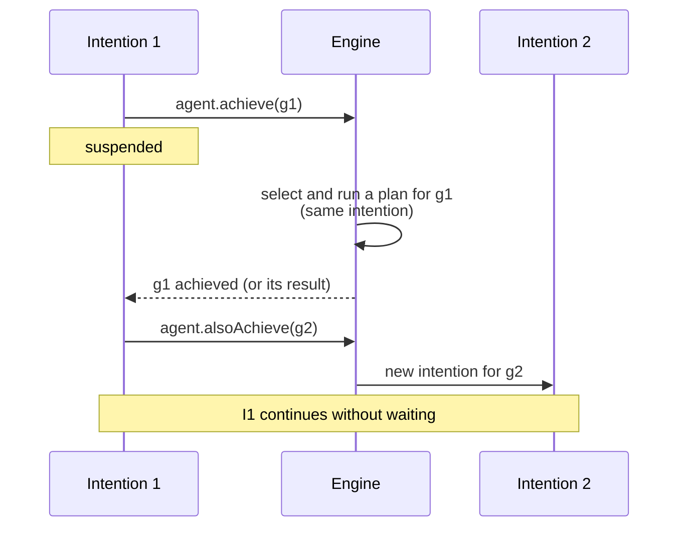

# Goals in JaKtA

Goals are the objectives an agent aims to achieve. Adding a goal generates an event that
selects a relevant [plan](./plans.md); executing that plan is an **intention**.

As for beliefs, the goal type is chosen by the [incarnation](../explanation/incarnations/index.md):
a Prolog `Struct` (`PrologGoal`) in the Prolog incarnation, a `String` in the string incarnation,
or any type you like.

## Initial goals

Initial goals are pursued as soon as the agent starts. Declare them with `hasInitialGoals { }` and `!`:

```kotlin
agent<PrologBelief, PrologGoal, Any> {
    embodiedAs { Any() }
    hasInitialGoals {
        !initialGoal { "start"(0, 10) }
    }
}
```

With the string incarnation (or plain `String` goals) it is simply `!"start"`.
Goals can also be added with `addGoal(goal)` in the agent builder.

## Sub-goals

A plan body can pursue new goals in two ways:

- `agent.achieve(goal)` pursues a **sub-goal** within the current intention and *suspends* until the sub-goal
  has been achieved. If the sub-goal fails and no [failure plan](./plans.md#failure-plans) recovers it,
  the calling plan fails as well.
- `agent.alsoAchieve(goal)` adds a goal that is pursued by a **new, concurrent intention**; the current plan
  does not wait for it.



In a Prolog plan use `goal { }` to build the goal, so that bound variables are substituted:

```kotlin
prologPlan {
    adding.goal {
        matchingGoal { "tower"(logicList(X, Y, tail = T)) }
    } triggers {
        agent.achieve(goal { "tower"(logicList(Y, tail = T)) })
        agent.achieve(goal { "on"(X, Y) })
    }
}
```

## Goals with results

Plans are Kotlin functions, so they can return a value. `achieveWithResult` pursues a sub-goal and returns
the value produced by the plan that achieved it:

```kotlin
adding.goal {
    takeIf { it == "compute" }
} triggers {
    42
}

adding.goal {
    takeIf { it == "start" }
} triggers {
    val result: Int = agent.achieveWithResult("compute")
    agent.print("The result is $result")
}
```

## Failure

A goal fails when no plan is applicable for it, or when the plan pursuing it throws an exception.
The failure generates a new event, which `failing.goal { }` plans can handle — see [Plans](./plans.md#failure-plans).

If a failure plan handles it, whoever was waiting on the goal (e.g. an `agent.achieve(...)` call) resumes
with the result of the failure plan. If no failure plan is applicable, or the failure plan fails too,
the failure propagates to the waiting plan.
