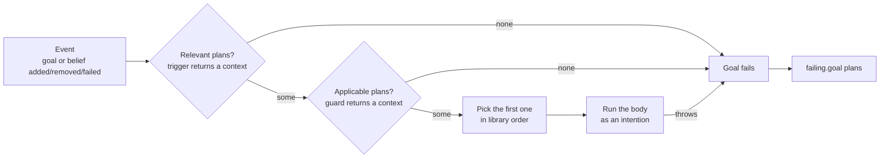

# Plans in JaKtA

Plans define **how** an agent reacts to events: new goals, belief changes, and failures.
A plan is made of three parts:

```kotlin
adding.goal { /* trigger */ } onlyWhen { /* guard (optional) */ } triggers { /* body */ }
```

Plans are declared in `hasPlanLibrary { }`.

## Triggers

A trigger selects the kind of event and decides whether the plan is **relevant** for it:

| Trigger | Fires when |
|---|---|
| `adding.goal { }` | a goal is added |
| `failing.goal { }` | a goal fails |
| `removing.goal { }` | a goal is removed |
| `adding.belief { }` | a belief is added |
| `removing.belief { }` | a belief is removed |

The trigger block receives the goal or belief as `this` and returns either `null` (the plan is not relevant)
or a **context** value, which is then available to the guard and body as `context`:

```kotlin
adding.belief {
    takeIf { it.first == "Ping!" }
} triggers {
    val (text, sender) = context
    // ...
}
```

Incarnations provide matching functions that build the context for you:
`matchingGoal { }` / `matchingBelief { }` in the Prolog incarnation (the context is a unifier),
`ifGoalMatches("...")` in the string incarnation.

## Guards

`onlyWhen { }` makes a relevant plan **applicable** only if a condition holds in the current state.
It can read `beliefs` and `context`, and returns the (possibly refined) context or `null`.
In the Prolog incarnation, `satisfies { }` proves a query against the belief base and adds its bindings:

```kotlin
prologPlan {
    adding.goal {
        matchingGoal { "start"(N, X) }
    } onlyWhen {
        satisfies { (N lowerThan X) and (S `is` (N + 1)) }
    } triggers {
        agent.print("Counting... ", N)
        agent.achieve(goal { "start"(S, X) })
    }
}
```

When several plans are relevant for an event, the first applicable one in the plan library is chosen:



## Bodies

The body, `triggers { }`, is a `suspend` Kotlin lambda. Anything Kotlin can do, a plan body can do:
call functions, use `delay(...)`, launch computations. Its receiver provides:

- `agent` — the agent's state:
  `believe`, `forget`, `achieve`, `alsoAchieve`, `achieveWithResult`, `print`, `beliefs`, and
  `wait(filter, timeout)` to suspend until a matching event happens;
- `node` — the [node](../explanation/nodes.md) the agent lives in (e.g. `node.terminateNode()`). It is not part of
  the plan scope: it comes from the enclosing `agent { }` / `node { }` builder, or from the `plans { node -> }` parameter;
- `context` — the value produced by the trigger and guard;
- any [skill](./skills.md) in scope.

In the Prolog incarnation, `X.value<T>()` extracts the Kotlin value bound to a logic variable,
e.g. `blocksWorld.move(X.value(), Y.value())`.

## Failure plans

`failing.goal { }` plans handle goal failures, e.g. to retry after changing the agent's knowledge:

```kotlin
prologPlan {
    failing.goal {
        matchingGoal { "start"(B) }
    } triggers {
        agent.print("start failed, retrying")
        agent.alsoAchieve(goal { "start"(B) })
    }
}
```

## Reusable plan libraries

`plans { node -> ... }` builds a list of plans outside an agent, which can then be installed with
`withPredefinedPlans(...)`. The `node` parameter lets the plans use node-bound skills:

```kotlin
val pingPlans = plans { node ->
    context(MessagingSkill(node)) {
        prologPlan {
            adding.goal {
                matchingGoal { Atom.of("start") }
            } triggers {
                agent.tellTo(bob, belief { "ping"(1) })
            }
        }
    }
}

agent(alice) {
    // ...
    withPredefinedPlans(pingPlans)
}
```
