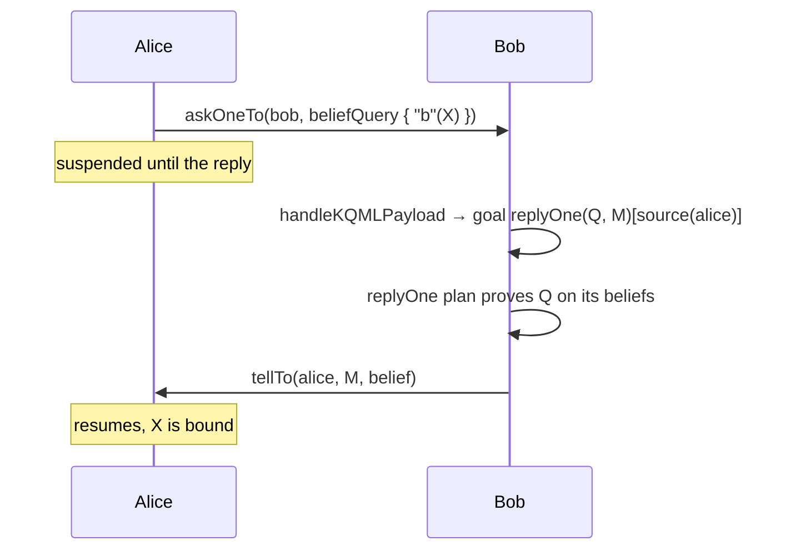

# Communication in JaKtA

Agents communicate by exchanging **messages**. Sending requires the `MessagingSkill`, and every agent decides how
received messages affect its state.

## Sending messages

`MessagingSkill(node)` (in `jakta-core`) provides:
- `agent.sendTo(receiver, payload)` to send a message to an agent, and
- `agent.broadcast(payload)` to send it to every agent.

The payload can be any object.

```kotlin
node {
    context(MessagingSkill(node)) {
        agent(alice) {
            // ...
            hasPlanLibrary {
                adding.goal {
                    takeIf { it == "sendPing" }
                } triggers {
                    agent.sendTo(bob, "Ping!")
                }
            }
        }
    }
}
```

## Receiving messages

Received messages are external events. `handlesMessageEvents` converts them into an `AgentUpdate` — typically new
beliefs, which then trigger `adding.belief { }` plans — or returns `null` to ignore the message:

```kotlin
handlesMessageEvents { message ->
    when (val payload = message.payload) {
        is String -> AgentUpdate.Belief(setOf(payload to message.sender), emptySet())
        else -> null
    }
}
```

`AgentUpdate.Goal(additions, removals)` can be returned instead, to accept a request as a new goal.

The [intermediate tutorial](../getting-started/tutorial.md) builds a full ping-pong example with these primitives.

## KQML messaging (Prolog incarnation)

The Prolog incarnation implements [KQML](https://en.wikipedia.org/wiki/Knowledge_Query_and_Manipulation_Language)
performatives, in the style of Jason. To receive them, delegate message handling to `handleKQMLPayload`:

```kotlin
handlesMessageEvents {
    when (val payload = it.payload) {
        is KQMLPayload -> handleKQMLPayload(payload, it.sender)
        else -> null
    }
}
```

Then, with a `MessagingSkill` in scope, plan bodies can use:

| Function | Performative | Effect on the receiver |
|---|---|---|
| `tellTo(receiver, belief)` / `broadcastTell(belief)` | tell | adds the belief, annotated with `[source(sender)]` |
| `untellTo(receiver, query)` / `broadcastUntell(query)` | untell | removes the matching beliefs received from that sender |
| `delegateAchieveTo(receiver, goal)` / `broadcastAchieve(goal)` | achieve | adds the goal, annotated with `[source(sender)]` |
| `sendUnachieveTo(receiver, query)` / `broadcastUnachieve(query)` | unachieve | removes the matching goal |
| `askOneTo(receiver, query)` | askOne | adds a `replyOne(query, id)[source(sender)]` goal; the sender suspends until a reply arrives |



Unlike Jason, questions are not answered automatically: the receiver needs a plan for `replyOne(Q, M)[source(S)]`
goals that answers with `tellTo(sender, questionId, belief)`.

Delegated goals carry their source too, and — unlike beliefs — a goal pattern must mention it to match them:
`matchingGoal { "job"(N)[source(S)] }`. See [Prolog caveats](./incarnations/prolog/caveats.md).

Received beliefs carry their source, which plans can match:

```kotlin
// Alice
agent.tellTo(bob, belief { "ping"(1) })

// Bob
prologPlan {
    adding.belief {
        matchingBelief { "ping"(1)[source(X)] }
    } triggers {
        agent.print("Received a ping from ", X)
    }
}
```

`askOneTo` returns the answer and binds the query's variables in the current plan. It returns `null` only on timeout;
an answer that does not unify with the query is a failed substitution:

```kotlin
val reply = agent.askOneTo(bob, beliefQuery { "b"(X) })
if (reply != null && reply.isSuccess) {
    agent.print("Received reply: ", X)
}
```

See [`TestKQMLMessaging`](https://github.com/jakta-bdi/jakta/blob/main/jakta-prolog-incarnation/src/commonTest/kotlin/it/unibo/jakta/TestKQMLMessaging.kt)
for complete examples of every performative, including a `replyOne` plan.

## Indirect communication

Agents can also coordinate *indirectly* (stigmergy) by acting on a shared world model through a
[skill](../basic-concepts/skills.md) and perceiving its changes — see [Nodes and environment](./nodes.md#perceptions).
