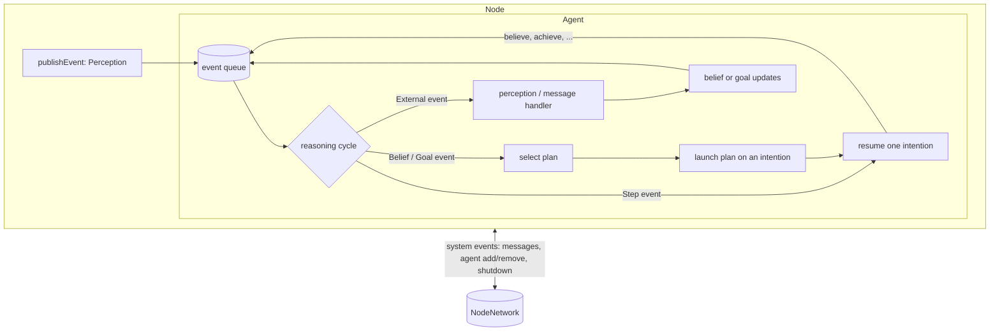
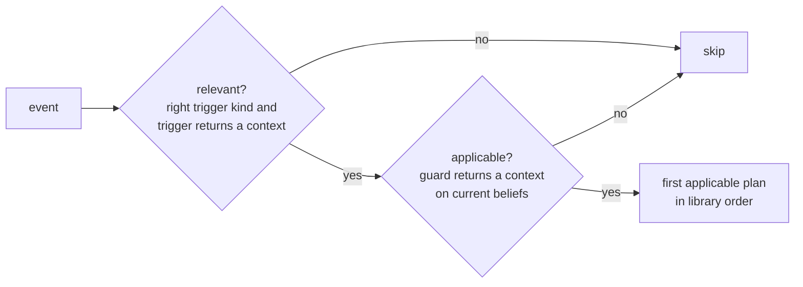
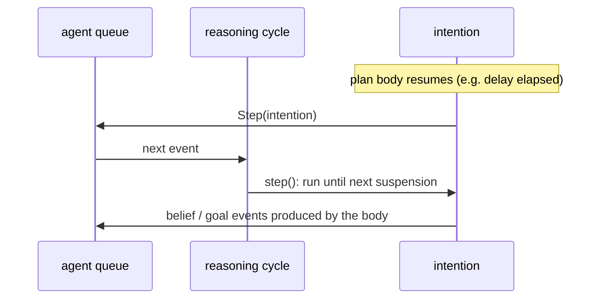
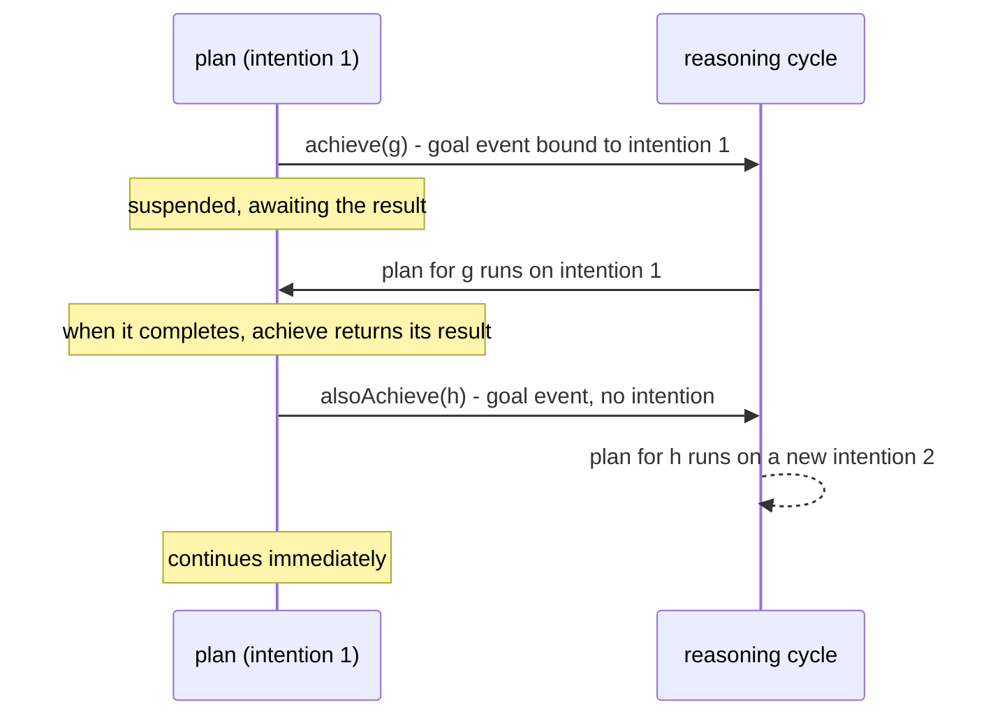

# Execution Model in JaKtA

This page describes how the JaKtA engine (`jakta-core`) runs agents: the reasoning cycle, how intentions map to
coroutines, and how nodes exchange events. Knowing it helps predict in which order things happen, and why plan bodies
can freely suspend. All references are to files in
[`jakta-core`](https://github.com/jakta-bdi/jakta/tree/main/jakta-core/src/commonMain/kotlin/it/unibo/jakta) and
[`jakta-api`](https://github.com/jakta-bdi/jakta/tree/main/jakta-api/src/commonMain/kotlin/it/unibo/jakta).

## Overview

## One queue per agent

Every agent (`BaseAgent.kt`) owns a **single FIFO event queue**. It is exposed as two inboxes:
- the **internal inbox**, where the agent itself posts belief events, goal events and intention steps;
- the **external inbox**, where the node delivers perceptions and messages.

Since both inboxes feed the same queue, events are handled in the order they were produced, whatever their origin.
For example, if a plan publishes a perception and then calls `agent.achieve(...)`, the perception is processed first,
so the beliefs are up to date when the plan for the new goal is selected.

When an agent is created, each initial goal is posted as if by `alsoAchieve`, i.e. each gets its own intention.
Initial beliefs are loaded without generating events.

## The reasoning cycle

The node runner executes each agent in its own coroutine, looping on `BaseAgentLifecycle.step()`:
wait for the next event, handle it, yield. Handling an event (`BaseAgentLifecycle.kt`) means:

1. **Wake up waiters.** Every pending `agent.wait(filter, timeout)` whose filter matches the event is resumed.
2. **Dispatch** on the event type:
   - **External** (perception or message): call the agent's `handlesPerceptionEvents` / `handlesMessageEvents`
     handler. The resulting `AgentUpdate` is applied: beliefs are added/removed (which posts belief events),
     goals are posted as goal-addition/removal events. A `null` update ignores the event.
   - **Belief or goal event**: select a plan and launch it (see below).
   - **Step**: resume one intention (see [Intentions](#intentions-are-coroutines)).

The belief base (`BeliefBaseImpl.kt`) is a set: adding a belief it already has, or removing one it doesn't,
changes nothing and posts no event. When an `AgentUpdate.Belief` contains the same belief in both
additions and removals, it is ignored.

## Plan selection

For every belief or goal event, the engine filters the agent's plan library (`selectPlan` in `BaseAgentLifecycle.kt`):

- A plan is **relevant** if it is of the right kind (`adding.goal`, `failing.goal`, `removing.belief`, ...) and its
  trigger returns a non-null context for the event's goal or belief.
- It is **applicable** if its guard, evaluated on the current beliefs and that context, returns a non-null context.
- The **first** applicable plan, in the order plans were added to the library, is selected.
  Order your plans from the most specific to the most general (see the [Blocks World tutorial](../getting-started/blocks-world.md#4-the-plans)).

If no plan is selected:
- for a **goal addition**, the goal **fails** (see [Failure](#failure-handling));
- for a **belief event** or a goal removal, the event is just logged and dropped. Belief changes without a matching plan are normal.

When the plan starts running, its trigger and guard are evaluated once more to build the context passed to the body
(`Plan.run` in `jakta-api/.../plan/Plan.kt`).

## Intentions are coroutines

A plan body is a `suspend` function, launched as a coroutine that belongs to an **intention**
(`BaseIntention.kt`, `BaseIntentionPool.kt`). Intentions are not scheduled by a thread pool.
Their coroutines run on an `IntentionDispatcher` (`jakta-api/.../intention/IntentionDispatcher.kt`), which does not run
a resumed continuation right away. Instead it:

1. enqueues the continuation in the intention;
2. posts a **Step** event for that intention in the agent's queue.

When the reasoning cycle reaches the Step event, it runs that continuation until the plan body suspends again,
e.g. on `achieve`, `delay`, `wait`, or any other suspending call.

As a consequence:
- **Agents are reactive while plans suspend.** During a `delay(...)` or while waiting for a sub-goal, the agent keeps
  processing perceptions, messages and other intentions.
- **Intentions interleave step by step.** Between two suspension points a plan body runs without interruption, and
  the agent's intentions never run in parallel with each other or with the reasoning cycle. Plan bodies can safely
  read and change the agent state without synchronization.
- **Blocking code blocks the agent.** Long computations or blocking I/O inside a plan body hold the agent's loop:
  use suspending APIs, or move the work to another dispatcher with `withContext(...)`.

`delay` keeps working, and works with virtual time in tests and in Alchemist, because `IntentionDispatcher` delegates
delays to the dispatcher the agent runs on.

## `achieve` vs `alsoAchieve`

- `agent.achieve(g)` / `achieveWithResult(g)` (`BaseMutableAgentState.kt`) posts a goal-addition event that carries
  the **current intention** and a completion. The selected plan runs **on the same intention**, and the caller
  suspends until the completion is resolved with the plan's return value.
- `agent.alsoAchieve(g)` posts a goal-addition event with **no intention**: the selected plan runs on a
  **new intention**, concurrently with the caller, and nobody waits for its result.

## Failure handling

A goal addition fails when no plan is applicable, or when its plan throws an exception. Then (`handleFailure`):

1. a goal-**failure** event is posted for the same goal, carrying the original intention and completion;
2. if a `failing.goal { }` plan is applicable, it runs, and **its result completes the original goal**: an
   `achieve` waiting for it resumes normally;
3. if no failure plan is applicable, or the failure plan fails too, the completion is completed exceptionally:
   the waiting `achieve` throws, so the calling plan fails in turn, and the failure propagates up the chain of sub-goals.

Goals posted with `alsoAchieve` or as initial goals have no completion: if they fail and no failure plan handles them,
the failure is only logged.

:::note
Removing a goal (e.g. with a KQML `unachieve`, or an `AgentUpdate.Goal` with removals) triggers `removing.goal { }`
plans, but does not currently stop intentions already pursuing that goal.
:::

## Nodes, runners and networks

A MAS (`BaseMasBuilder.kt`) runs each of its nodes concurrently with the given `NodeRunner`, and `run` returns when
all nodes have terminated.

`CoroutineNodeRunner` (`CoroutineNodeRunner.kt`) runs a node as follows:
- it subscribes the node to a `NodeNetwork` and forwards the node's **system events** to it:
  agent additions and removals, messages, shutdown requests;
- it receives system events from the network, lets the node handle them, and reacts to them:
  it starts a coroutine for every added agent, cancels removed agents, and stops the node on shutdown.

`SharedMemoryNetwork` (`SharedMemoryNetwork.kt`) is an in-process network that broadcasts every system event to
every subscribed node. The Alchemist incarnation provides its own node and dispatching on top of the simulator.

Two kinds of events reach agents differently (`BaseNode.kt`):
- **Perceptions** published with `node.publishEvent(...)` are delivered directly to the node's own agents whose body
  passes the filter. They never leave the node.
- **Messages** travel as system events through the network, so every node receives them and delivers them to its
  local agents that pass the filter. This is how `sendTo` reaches agents on other nodes.

`MessagingSkill.sendTo` addresses the receiver through its body: the filter selects the agent whose body
maps back to the receiver's ID (`Node.getAgentIDfromBody`). Give each agent a distinct body instance
(`embodiedAs { Any() }` does) so that bodies identify agents unambiguously.

## Adding, removing and terminating

- `node.addAgent(factory)` and the agents declared in `node { }` are posted as agent-addition system events.
  Each agent starts once its node's runner receives the event.
- `node.removeAgent(id)` posts a removal event: the runner cancels the agent's reasoning loop. Since intentions only
  progress through Step events handled by that loop, none of them runs any further.
- An agent whose loop crashes with an unexpected exception is removed from its node.
- `node.terminateNode()` posts a shutdown event for the node. When the runner receives it, it closes the node's
  subscription and cancels all the node's agents; the node's `run` then completes.
