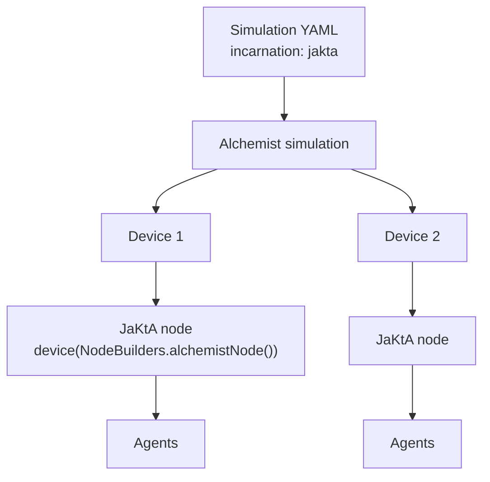

# Alchemist Incarnation

`alchemist-jakta-incarnation` runs JaKtA inside the [Alchemist](https://alchemistsimulator.github.io/) simulator.

## Purpose

Alchemist simulates large systems of situated, communicating devices. In Alchemist's own terminology, an
*incarnation* is a plug-in that defines what runs on each simulated device. This module is JaKtA's plug-in:
each Alchemist node hosts JaKtA nodes, agents run in **simulated time**, and devices are connected by Alchemist's
network model. It's the way to evaluate a MAS at scale, in a reproducible way.

It does **not** fix the belief and goal types: use it together with the representation you prefer.

The setup is described in [Simulate a MAS with Alchemist](../../how-to/alchemist.md).

## Caveats

- **Entry points are found by reflection.** The YAML `program` is `<JVM class>.<function>`. The function must be
  public and return the result of `device(...)`. Use `@file:JvmName` to give the file a predictable class name.
- **Delays are rounded down to whole seconds.** A `delay` inside a plan is converted to simulated time by integer
  division (`timeMillis / 1000`), so `delay(500.milliseconds)` takes no simulated time and `delay(1500.milliseconds)`
  takes one second.
- **No agent removal.** Removing an agent from a node during a simulation is not supported yet.
- **No Alchemist actions or conditions from YAML.** Behavior must be defined in JaKtA; only the time distribution
  (a fixed rate) can be configured in YAML.
- **JVM 17+ only.**
