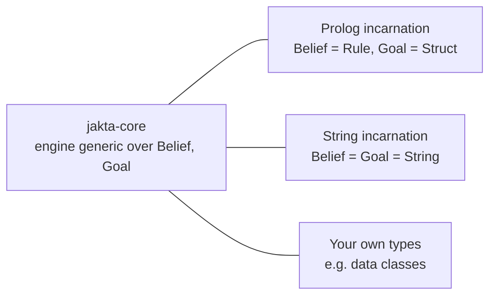

# Incarnations in JaKtA

The JaKtA engine is generic over three types: `Belief`, `Goal` and `Body`. It never looks inside beliefs and goals:
plans decide whether an event is **relevant** (their trigger) and **applicable** (their guard).
So the way knowledge is represented is not part of the engine, and you can swap it.

An **incarnation** fixes that representation. It provides the belief and goal types, and the helpers to build
them and to match them in triggers and guards. You pick one by adding its dependency and using its types;
there is no runtime switch.

## Which one should I use?

| | [Prolog](./prolog/index.md) | [String](./string.md) | [Your own types](../../how-to/custom-incarnation.md) |
|---|---|---|---|
| Purpose | Jason-style, logic-based agents | Teaching, demos, tests | Domain-specific models |
| Matching | Unification, with variables bound into the plan | Exact string equality or regex | Any Kotlin function |
| Reasoning | Inference rules, Prolog queries in guards | Checks whether a belief is present | Whatever you write |
| Messaging | KQML (tell, achieve, askOne, ...) | Raw `sendTo` | Raw `sendTo` |
| Platforms | JVM, JS | JVM, JS, native | JVM, JS, native |

- If you know Jason or AgentSpeak, or your agents need to *reason* over what they know, use the **Prolog incarnation**.
- To try the engine out, or write tests, the **string incarnation** is the smallest thing that works.
- If your domain is naturally made of Kotlin objects, **define your own types**: see
  [Write your own incarnation](../../how-to/custom-incarnation.md).

:::note[What about the Alchemist incarnation?]
`alchemist-jakta-incarnation` is an incarnation in the [Alchemist](https://alchemistsimulator.github.io/) sense:
it plugs JaKtA into the Alchemist simulator. It does not fix belief or goal types, and you combine it with one of
the options above. See [Alchemist](./alchemist.md).
:::
