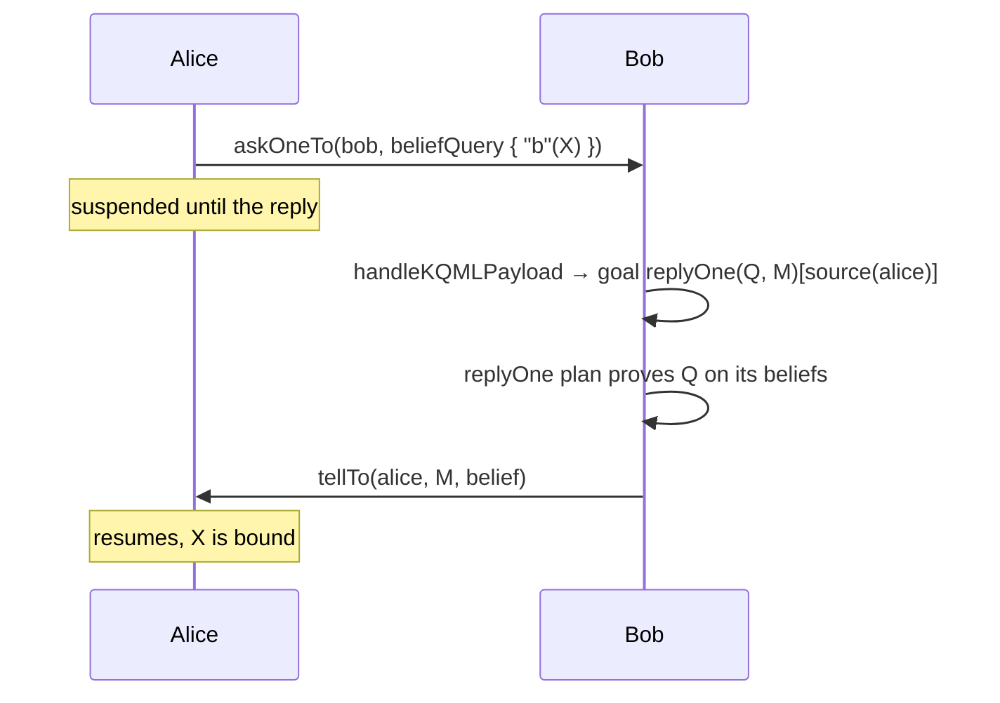

# KQML Messaging

The Prolog incarnation implements [KQML](https://en.wikipedia.org/wiki/Knowledge_Query_and_Manipulation_Language)
performatives on top of JaKtA's [messages](../../communication.md), in the style of Jason. A performative says what the
receiver should do with the content: believe it, pursue it, or answer it. Receiving agents hand KQML payloads to
`handleKQMLPayload`, which turns each one into an update of their beliefs or goals:

| Function | Performative | Effect on the receiver |
|---|---|---|
| `tellTo(receiver, belief)` / `broadcastTell(belief)` | tell | adds the belief, annotated with `[source(sender)]` |
| `untellTo(receiver, query)` / `broadcastUntell(query)` | untell | removes the matching beliefs received from that sender |
| `delegateAchieveTo(receiver, goal)` / `broadcastAchieve(goal)` | achieve | adds the goal, annotated with `[source(sender)]` |
| `sendUnachieveTo(receiver, query)` / `broadcastUnachieve(query)` | unachieve | removes the goal delegated by that sender |
| `askOneTo(receiver, query)` | askOne | adds a `replyOne(query, id)[source(sender)]` goal; the sender suspends until a reply arrives |
| `askAllTo(receiver, query)` | askAll | adds a `replyAllTo(query, id)[source(sender)]` goal; the sender suspends until a reply with all the answers arrives |

## Sources

Everything an agent receives carries the sender in a `source` annotation, so plans can tell their own beliefs and
goals from those of others, and answer the sender. Goals and beliefs follow the same
[annotation rules](./beliefs-and-goals.md#annotations-and-sources): a pattern without annotations matches whatever the
source, and `[source(S)]` binds `S` to the sender, or to `self`.

## Questions

Questions are goals. Unlike Jason, they are not answered automatically: the receiver decides how to answer with a
plan for `replyOne` (or `replyAllTo`) goals, which tells the answer back with the question id.

`askOneTo` binds the query's variables in the asking plan; `askAllTo` returns one substitution per answer instead.
Both return `null` if no reply arrives before the timeout.

See [Ask and answer with KQML](../../../how-to/prolog/kqml.md) for the code of each step, and the
[`contract-net`](https://github.com/jakta-bdi/jakta/tree/main/examples/contract-net) example for a complete program.
