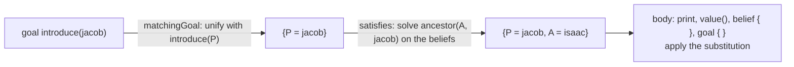

# Prolog Plans

Every Prolog plan in this documentation is wrapped in `prologPlan { }`:

```kotlin
hasPlanLibrary {
    prologPlan {
        adding.goal {
            matchingGoal { "introduce"(P) }
        } onlyWhen {
            satisfies { "ancestor"(A, P) }
        } triggers {
            agent.print(P, " descends from ", A)
        }
    }
}
```

## What `prologPlan` does

`prologPlan` is a tiny function:

```kotlin
inline fun PlanLibraryBuilder<PrologBelief, PrologGoal>.prologPlan(
    block: JaktaLogicProgrammingScope.() -> Unit,
): Unit = with(JaktaLogicProgrammingScope(), block)
```

It opens a **new 2P-Kt logic programming scope** and defines plans inside it. This has three consequences.

**1. The Prolog DSL and the Prolog helpers become available.**
The block's receiver is the scope, so `"f"(X)`, `impliedBy`, `and` and friends work.
Plan helpers such as `matchingGoal`, `matchingBelief`, `satisfies`, `testQuery`, `belief { }`, `goal { }` and
`beliefQuery { }` take the scope as a **context parameter**, so they only compile inside a `prologPlan`.

**2. Variables are shared across trigger, guard and body.**
Within one scope, `P` always refers to the same variable. That is what makes `P` in the trigger, the guard and
the body the *same* `P`. Each `prologPlan` gets a fresh scope, so variables never leak from one plan to another.
The convention is one plan per `prologPlan` block.

**3. The plan context is a substitution.**
Triggers and guards produce a `MutableSubstitutionPlanContext`, a mutable 2P-Kt `Substitution`.
It fills up as the plan runs:



- A **trigger** (`matchingGoal`, `matchingBelief`) unifies the event with a pattern and yields the unifier, or `null`.
- A **guard** (`satisfies`) runs a Prolog query on the belief base, starting from the bindings so far, and adds its
  solution; it yields `null` if the query fails. Only the first solution is used.
- In the **body**, `X.value<T>()` reads a binding, `print(...)` prints variables with their values,
  and `belief { }`, `goal { }` and `beliefQuery { }` build terms with the substitution applied.
  `testQuery { }` extends the substitution further, and fails the plan if its query does not hold.

## Plans without `prologPlan`

`prologPlan` is optional. A Prolog agent can also have plain plans, whose trigger is any function of the goal or belief.
You just don't get variables or unification in them:

```kotlin
adding.goal {
    takeIf { it == Atom.of("start") }
} triggers {
    agent.print("started")
}
```

See the [Prolog Incarnation Reference](../../../reference/prolog-incarnation.md#prolog-plans) for every helper.
