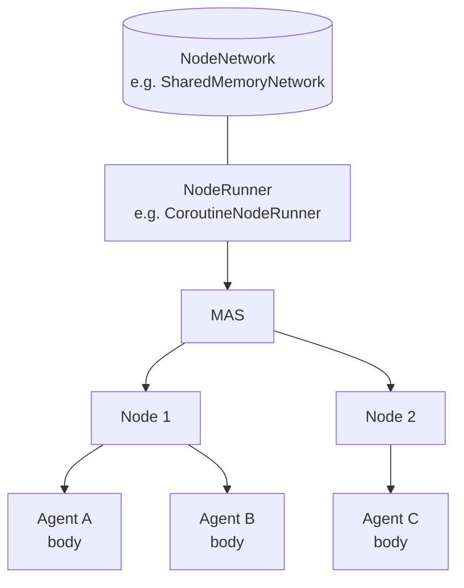
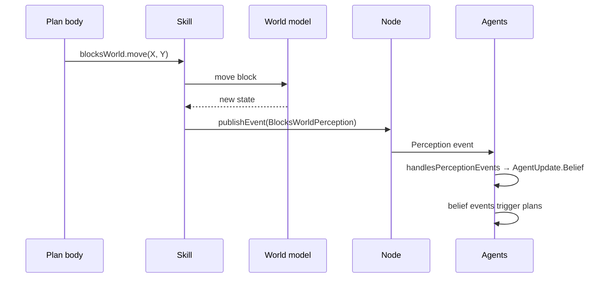

# Nodes and Environment in JaKtA

A JaKtA multi-agent system is made of **nodes**, and each node hosts a set of **agents**.
The node is the agents' environment: it delivers perceptions and messages to them, and it is where agents are
added, removed and terminated.

```kotlin
mas(NodeBuilders.baseNode()) {
    node {
        withAgents(helloWorldAgent)   // agents defined elsewhere with agent { }
        agent(BaseAgentID("inline")) { /* ... */ }
    }
    node { /* another node */ }
}.run(CoroutineNodeRunner(SharedMemoryNetwork()))
```



Nodes can also be defined on their own with `node(NodeBuilders.baseNode()) { ... }` and combined with
`mas(...) { withNodes(nodeA, nodeB) }`.

## Bodies

Each agent has a **body**, its representation inside the node, created with `embodiedAs { id -> ... }`.
The body type is the third type parameter of `agent<Belief, Goal, Body>` and of `NodeBuilders.baseNode<Body>()`.
Agents that do not need a body use `Any`. A body can carry state the environment cares about — a position,
a battery level — and skills can use it
(see [`TestSpatialRobot`](https://github.com/jakta-bdi/jakta/blob/main/jakta-core/src/commonTest/kotlin/it/unibo/jakta/dsl/examples/TestSpatialRobot.kt)).

## Perceptions

There is no shared environment object that agents query. Instead, whatever models the world publishes
**perception events** on the node, and each agent turns them into its own beliefs:

```kotlin
data class BlocksWorldPerception(val state: List<List<Block>>) : Perception

// inside a skill or any code holding the node
node.publishEvent(BlocksWorldPerception(state))

// inside the agent definition
handlesPerceptionEvents {
    when (it) {
        is BlocksWorldPerception -> handleBlocksWorldPerceptions(it, beliefs)
        else -> null
    }
}
```



`publishEvent(event, filterFunction)` accepts a filter on agent bodies, to deliver a perception only to some agents
(e.g. those close to where something happened).

Agents act on the world through [skills](../basic-concepts/skills.md), which typically update the world model and
publish the resulting perceptions.

## Managing agents at runtime

From a plan body or a skill:
- `node.addAgent(agentFactory)` adds a new agent built with `agent { }`;
- `node.removeAgent(id)` removes an agent;
- `node.terminateNode()` stops the node and all its agents.

## Running

A `NodeRunner` executes the nodes of a MAS:
- `CoroutineNodeRunner(SharedMemoryNetwork())` runs every agent on coroutines, with all nodes in the same process
  sharing memory for message delivery. `runLocally()` is a shorthand for it.
- The [Alchemist incarnation](../how-to/alchemist.md) runs nodes as simulated devices, with simulated time.
