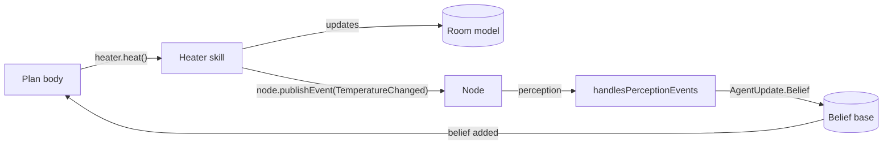

# Connect agents to an environment

JaKtA has no built-in environment class: the environment is **your** Kotlin model of the world.
Agents are connected to it in two directions:

- **acting**: a [skill](../basic-concepts/skills.md) exposes the operations agents can perform on the model;
- **perceiving**: the model (or the skill) publishes **perceptions** on the node, and each agent turns them into
  beliefs with `handlesPerceptionEvents`.



This guide builds a thermostat agent that heats a room until it is warm enough. It only needs `jakta-core`.

## 1. Model the world

```kotlin
// The world model: a room with a temperature.
class Room(var temperature: Int)

// What agents perceive.
data class TemperatureChanged(val degrees: Int) : Perception

// What agents believe.
data class Temperature(val degrees: Int)
```

A perception is any class implementing `AgentEvent.External.Perception`.
It is kept separate from the belief type: agents decide how a perception affects what they believe.

## 2. Write the skill

The skill holds the model and the node, acts on the former and notifies the latter:

```kotlin
class Heater(private val room: Room, private val node: Node<*>) {
    fun sense() = node.publishEvent(TemperatureChanged(room.temperature))

    fun heat() {
        room.temperature += 1
        node.publishEvent(TemperatureChanged(room.temperature))
    }
}

context(heater: Heater)
val PlanScope<*, *, *>.heater get() = heater
```

The extension property lets plan bodies write `heater.heat()`, and only compiles where a `Heater` is in scope.

## 3. Turn perceptions into beliefs

`handlesPerceptionEvents` returns an `AgentUpdate.Belief(additions, removals)`, or `null` to ignore a perception.
Removing the previously perceived temperature keeps a single, up-to-date belief:

```kotlin
handlesPerceptionEvents { perception ->
    when (perception) {
        is TemperatureChanged -> AgentUpdate.Belief(
            additions = setOf(Temperature(perception.degrees)),
            removals = beliefs.toSet(), // forget the old temperature
        )
        else -> null
    }
}
```

A belief that appears in both sets is left untouched, and generates no event.

## 4. Put it together

```kotlin
fun main(): Unit = runBlocking {
    val room = Room(temperature = 17)
    mas(NodeBuilders.baseNode()) {
        node {
            context(Heater(room, node)) {
                agent<Temperature, String> {
                    embodiedAs { Any() }
                    handlesPerceptionEvents { perception ->
                        when (perception) {
                            is TemperatureChanged -> AgentUpdate.Belief(
                                additions = setOf(Temperature(perception.degrees)),
                                removals = beliefs.toSet(),
                            )
                            else -> null
                        }
                    }
                    hasInitialGoals { !"keepWarm" }
                    hasPlanLibrary {
                        adding.goal {
                            takeIf { it == "keepWarm" }
                        } triggers {
                            heater.sense()
                        }
                        adding.belief {
                            takeIf { it.degrees < 20 }
                        } triggers {
                            agent.print("It's ${context.degrees}°C, heating")
                            heater.heat()
                        }
                        adding.belief {
                            takeIf { it.degrees >= 20 }
                        } triggers {
                            agent.print("It's ${context.degrees}°C, warm enough")
                            node.terminateNode()
                        }
                    }
                }
            }
        }
    }.runLocally()
}
```

Output:

```
It's 17°C, heating
It's 18°C, heating
It's 19°C, heating
It's 20°C, warm enough
```

The agent never polls the room: each `heat()` produces a perception, the perception replaces the temperature belief,
and the new belief triggers the next plan.

<details>
<summary>Imports</summary>

```kotlin
import it.unibo.jakta.dsl.mas
import it.unibo.jakta.dsl.mas.runLocally
import it.unibo.jakta.dsl.node.NodeBuilders
import it.unibo.jakta.dsl.plan.triggers
import it.unibo.jakta.event.AgentEvent.External.Perception
import it.unibo.jakta.event.AgentUpdate
import it.unibo.jakta.node.Node
import it.unibo.jakta.plan.PlanScope
import kotlinx.coroutines.runBlocking
```

</details>

## Deliver a perception to some agents only

`publishEvent` takes an optional filter on agent **bodies**: the perception is delivered only to the agents of the
node whose body satisfies it. For instance, to notify a single agent:

```kotlin
node.publishEvent(Moved(x, y)) { body -> body === node.agents[agentId] }
```

This is most useful together with [custom bodies](./custom-body.md), e.g. to deliver a perception only to the
agents close to where something happened.

:::note
Perceptions are delivered to agents of the node that publishes them. To reach agents on other nodes, use
[messages](../explanation/communication.md).
:::

## Using the Prolog incarnation

The same pattern works with Prolog beliefs: the perception handler builds Prolog facts and removes the stale ones.
The [`blocksworld`](https://github.com/jakta-bdi/jakta/tree/main/examples/blocksworld) example does exactly that in
[`BlocksWorldSkills.kt`](https://github.com/jakta-bdi/jakta/blob/main/examples/blocksworld/src/main/kotlin/BlocksWorldSkills.kt).
