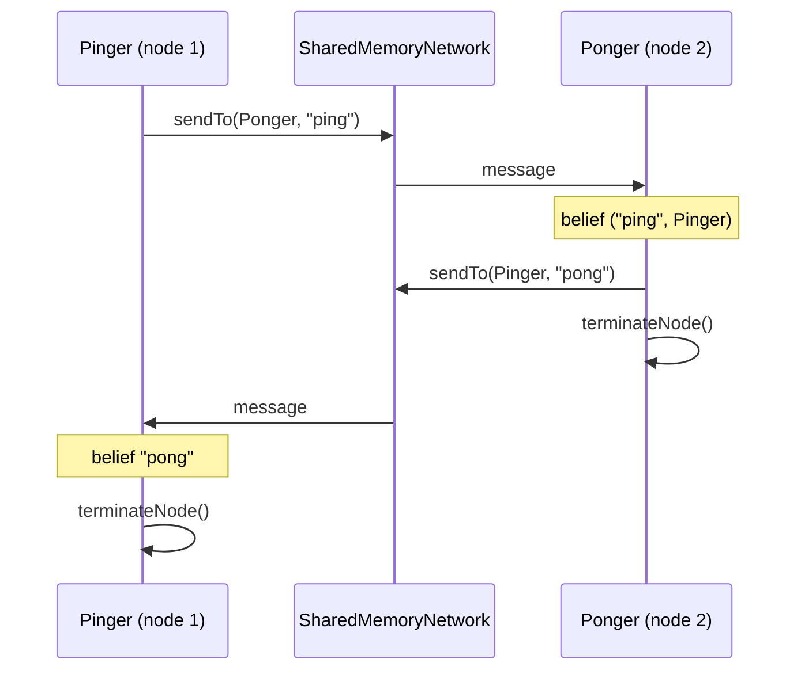

# Run a MAS with multiple nodes

A MAS can be split into several **nodes**. Each node has its own agents and delivers its own perceptions,
while **messages** travel across nodes through the network that connects them.

## Define the nodes

Nodes can be declared inline, with several `node { }` blocks in `mas { }`, or on their own with
`node(NodeBuilders.baseNode()) { }` and combined with `withNodes(...)`.
Here two agents on two different nodes play ping-pong:

```kotlin
val pinger = BaseAgentID("Pinger")
val ponger = BaseAgentID("Ponger")

val pingNode = node(NodeBuilders.baseNode()) {
    context(MessagingSkill(node)) {
        agent<String, String>(pinger) {
            embodiedAs { Any() }
            handlesMessageEvents { message ->
                (message.payload as? String)?.let { AgentUpdate.Belief(setOf(it)) }
            }
            hasInitialGoals { !"ping" }
            hasPlanLibrary {
                adding.goal {
                    takeIf { it == "ping" }
                } triggers {
                    agent.sendTo(ponger, "ping")
                }
                adding.belief {
                    takeIf { it == "pong" }
                } triggers {
                    agent.print("Got pong from the other node")
                    node.terminateNode()
                }
            }
        }
    }
}

val pongNode = node(NodeBuilders.baseNode()) {
    context(MessagingSkill(node)) {
        agent<Pair<String, AgentID>, String>(ponger) {
            embodiedAs { Any() }
            handlesMessageEvents { message ->
                (message.payload as? String)?.let { AgentUpdate.Belief(setOf(it to message.sender)) }
            }
            hasPlanLibrary {
                adding.belief {
                    takeIf { it.first == "ping" }
                } triggers {
                    agent.print("Got ping, replying")
                    agent.sendTo(context.second, "pong")
                    node.terminateNode()
                }
            }
        }
    }
}
```

## Run them together

```kotlin
fun main(): Unit = runBlocking {
    mas(NodeBuilders.baseNode()) {
        withNodes(pingNode, pongNode)
    }.run(CoroutineNodeRunner(SharedMemoryNetwork()))
}
```



## How it works

- `CoroutineNodeRunner` runs every node concurrently, and `run` returns when **all** nodes have terminated.
  Each node stops independently, with `node.terminateNode()`.
- `SharedMemoryNetwork` connects nodes living in the same process. Nodes publish their system events — messages,
  agent additions and removals, shutdown requests — on the network, and every node receives them.
- `sendTo(receiver, payload)` delivers the message to the agent with that ID on whichever node it lives;
  `broadcast(payload)` reaches all the other agents, on all nodes.
- **Perceptions stay local**: `node.publishEvent(perception)` only reaches the agents of that node.

<details>
<summary>Imports</summary>

```kotlin
import it.unibo.jakta.agent.AgentID
import it.unibo.jakta.agent.BaseAgentID
import it.unibo.jakta.dsl.mas
import it.unibo.jakta.dsl.node
import it.unibo.jakta.dsl.node.NodeBuilders
import it.unibo.jakta.dsl.plan.triggers
import it.unibo.jakta.event.AgentUpdate
import it.unibo.jakta.node.CoroutineNodeRunner
import it.unibo.jakta.node.SharedMemoryNetwork
import it.unibo.jakta.skills.MessagingSkill
import it.unibo.jakta.skills.sendTo
import kotlinx.coroutines.runBlocking
```

</details>

To distribute nodes over a simulated network, with positions and connectivity, see
[Simulate a MAS with Alchemist](./alchemist.md).
