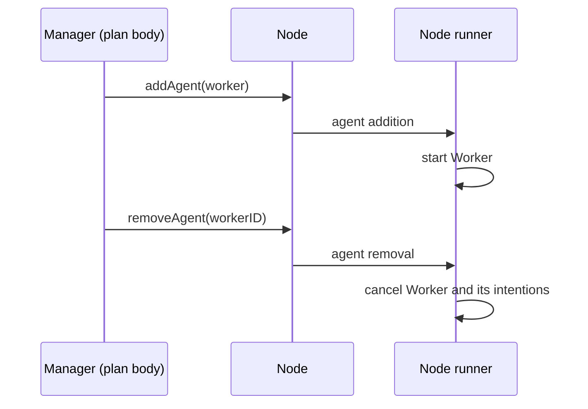

# Add and remove agents at runtime

The agents of a node are not fixed: plan bodies (and skills) can create new agents and remove existing ones
while the MAS runs.

## Add an agent

Define the agent with the top-level `agent { }` function — it returns a factory — and pass it to
`node.addAgent(...)`:

```kotlin
val workerID = BaseAgentID("Worker")

val worker = agent<String, String, Any>(workerID) {
    embodiedAs { Any() }
    hasInitialGoals { !"work" }
    hasPlanLibrary {
        adding.goal {
            takeIf { it == "work" }
        } triggers {
            agent.print("Worker started")
            delay(10.seconds)
            agent.print("Worker done") // never printed: the worker is removed before
        }
    }
}
```

## Remove an agent

`node.removeAgent(id)` stops an agent and cancels all its intentions:

```kotlin
fun main(): Unit = runBlocking {
    mas(NodeBuilders.baseNode()) {
        node {
            agent<String, String>(BaseAgentID("Manager")) {
                embodiedAs { Any() }
                hasInitialGoals { !"manage" }
                hasPlanLibrary {
                    adding.goal {
                        takeIf { it == "manage" }
                    } triggers {
                        node.addAgent(worker)
                        delay(1.seconds)
                        agent.print("Agents: ${node.agents.keys.map { it.displayName }}")
                        node.removeAgent(workerID)
                        delay(1.seconds)
                        agent.print("Agents: ${node.agents.keys.map { it.displayName }}")
                        node.terminateNode()
                    }
                }
            }
        }
    }.runLocally()
}
```

Output:

```
Worker started
Agents: [Manager, Worker]
Agents: [Manager]
```

Addition and removal are asynchronous: they are requests handled by the node runner, so the change is visible in
`node.agents` shortly after the call, not immediately.

## Let an agent terminate itself

`agent.terminate()` removes the agent executing the plan. It needs the node (or an `AgentTerminationSkill`) in scope:

```kotlin
adding.goal {
    takeIf { it == "quit" }
} triggers {
    agent.print("Bye!")
    with(node) { agent.terminate() }
}
```

To make it available to all the plans of some agents, wrap them in `context(AgentTerminationSkill(node)) { ... }`
and call `agent.terminate()` directly.

<details>
<summary>Imports</summary>

```kotlin
import it.unibo.jakta.agent.BaseAgentID
import it.unibo.jakta.dsl.agent
import it.unibo.jakta.dsl.mas
import it.unibo.jakta.dsl.mas.runLocally
import it.unibo.jakta.dsl.node.NodeBuilders
import it.unibo.jakta.dsl.plan.triggers
import it.unibo.jakta.skills.terminate
import kotlin.time.Duration.Companion.seconds
import kotlinx.coroutines.delay
import kotlinx.coroutines.runBlocking
```

</details>


