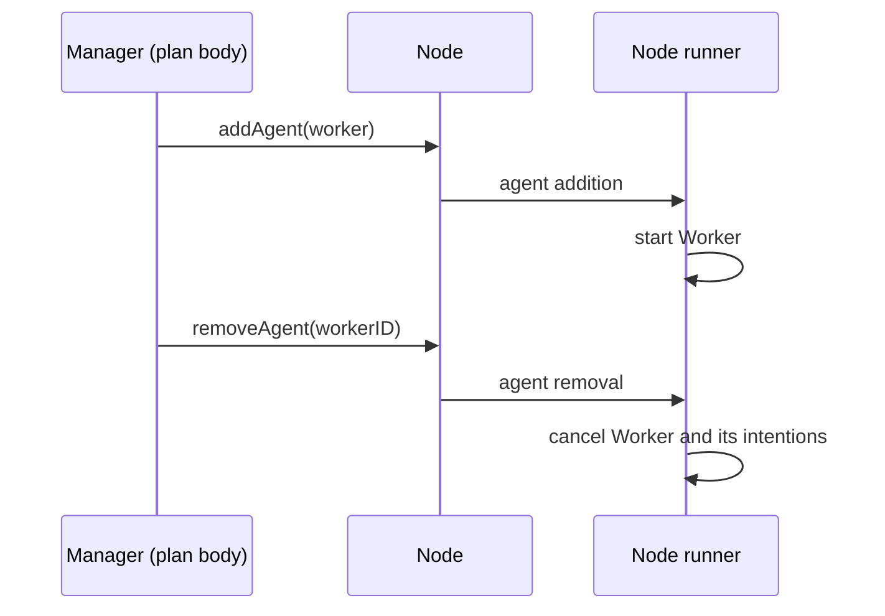

# Add and remove agents at runtime

Plan bodies (and skills) can add agents to their node and remove them while the MAS runs.
The complete program is the [`runtime-agents`](https://github.com/jakta-bdi/jakta/tree/main/examples/runtime-agents)
example; run it with `./gradlew :examples:runtime-agents:run`.

## Define the agent to add

The top-level `agent(id) { }` returns a factory, which the node calls when the agent joins it:

```kotlin
private val workerID = BaseAgentID("Worker")

private val worker = agent<String, String, Any>(workerID) {
    embodiedAs { Any() }
    // goals and plans as usual
}
```

## Add it

From a plan body, pass the factory to `node.addAgent`:

```kotlin
} triggers {
    node.addAgent(worker)
}
```

## Remove an agent

`node.removeAgent(id)` stops the agent and cancels all its intentions:

```kotlin
node.removeAgent(workerID)
```

Both are requests handled by the node runner: the change shows up in `node.agents` shortly after the call,
not immediately.


```mermaid
sequenceDiagram
    participant M as Manager (plan body)
    participant N as Node
    participant R as Node runner
    M->>N: addAgent(worker)
    N->>R: agent addition
    R->>R: start Worker
    M->>N: removeAgent(workerID)
    N->>R: agent removal
    R->>R: cancel Worker and its intentions
```

## List the agents of the node

`node.agents` maps each agent ID to its body:

```kotlin
agent.print("Agents: ${node.agents.keys.map { it.displayName }}")
```

## Let an agent terminate itself

`agent.terminate()` (from `it.unibo.jakta.skills.terminate`) removes the agent running the plan.
It needs the node in scope:

```kotlin
} triggers {
    agent.print("Bye!")
    with(node) { agent.terminate() }
}
```

To make it available to all the plans of some agents, wrap them in `context(AgentTerminationSkill(node)) { ... }`
and call `agent.terminate()` directly.
