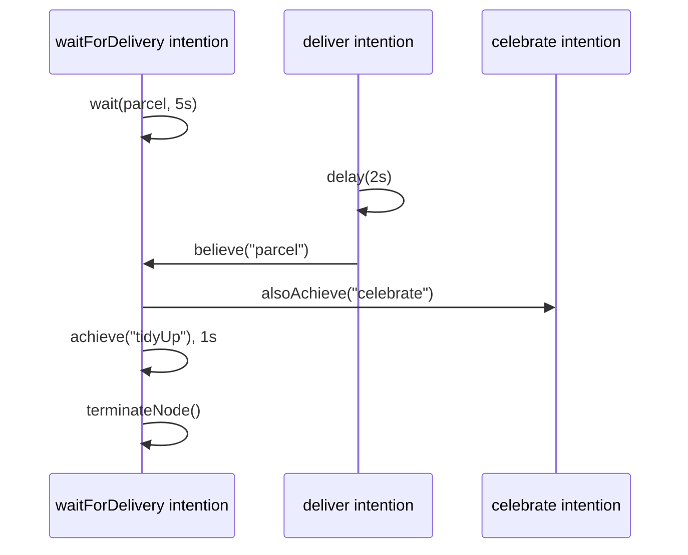

# Wait for events and use time

Plan bodies are `suspend` functions running on coroutines, so an intention can pause — for some time, or until
something happens — without blocking the agent: its other intentions keep running meanwhile.

## Wait for some time

Use `delay` from `kotlinx.coroutines`:

```kotlin
adding.goal {
    takeIf { it == "tidyUp" }
} triggers {
    delay(1.seconds)
}
```

## Wait for an event

`agent.wait(filter, timeout)` suspends the intention until the agent receives an event for which `filter` returns
a non-null value, and returns that value. With a `timeout`, it returns `null` if nothing arrived in time.

The filter sees every event the agent handles: belief and goal events (`AgentEvent.Internal`), as well as incoming
messages and perceptions (`AgentEvent.External`).

```kotlin
fun beliefAdded(expected: String): (AgentEvent) -> String? = { event ->
    (event as? AgentEvent.Internal.Belief.Add<*>)?.belief?.takeIf { it == expected } as String?
}

// in a plan body
val parcel = agent.wait(beliefAdded("parcel"), timeout = 5.seconds)
if (parcel != null) agent.print("Parcel received!") else agent.print("Gave up waiting")
```

## Run intentions concurrently

- Every initial goal, and every event-triggered plan, runs in its own intention.
- `agent.alsoAchieve(goal)` starts a **new** intention for the goal, and returns immediately.
- `agent.achieve(goal)` runs the sub-goal in the **current** intention, and returns when it is achieved.

## Put it together

```kotlin
fun main(): Unit = runBlocking {
    mas(NodeBuilders.baseNode()) {
        node {
            agent<String, String> {
                embodiedAs { Any() }
                hasInitialGoals {
                    !"waitForDelivery"
                    !"deliver"
                }
                hasPlanLibrary {
                    adding.goal {
                        takeIf { it == "waitForDelivery" }
                    } triggers {
                        agent.print("Waiting for the parcel...")
                        val parcel = agent.wait(beliefAdded("parcel"), timeout = 5.seconds)
                        if (parcel != null) agent.print("Parcel received!") else agent.print("Gave up waiting")
                        agent.alsoAchieve("celebrate")
                        agent.achieve("tidyUp")
                        agent.print("Tidied up")
                        node.terminateNode()
                    }
                    adding.goal {
                        takeIf { it == "deliver" }
                    } triggers {
                        delay(2.seconds)
                        agent.believe("parcel")
                    }
                    adding.goal {
                        takeIf { it == "celebrate" }
                    } triggers {
                        agent.print("Celebrating, concurrently")
                    }
                    adding.goal {
                        takeIf { it == "tidyUp" }
                    } triggers {
                        delay(1.seconds)
                    }
                }
            }
        }
    }.runLocally()
}
```

Output:

```
Waiting for the parcel...
Parcel received!
Celebrating, concurrently
Tidied up
```



<details>
<summary>Imports</summary>

```kotlin
import it.unibo.jakta.agent.achieve
import it.unibo.jakta.dsl.mas
import it.unibo.jakta.dsl.mas.runLocally
import it.unibo.jakta.dsl.node.NodeBuilders
import it.unibo.jakta.dsl.plan.triggers
import it.unibo.jakta.event.AgentEvent
import kotlin.time.Duration.Companion.seconds
import kotlinx.coroutines.delay
import kotlinx.coroutines.runBlocking
```

</details>

:::tip
In [Alchemist simulations](./alchemist.md), `delay` advances in **simulated** time.
:::
