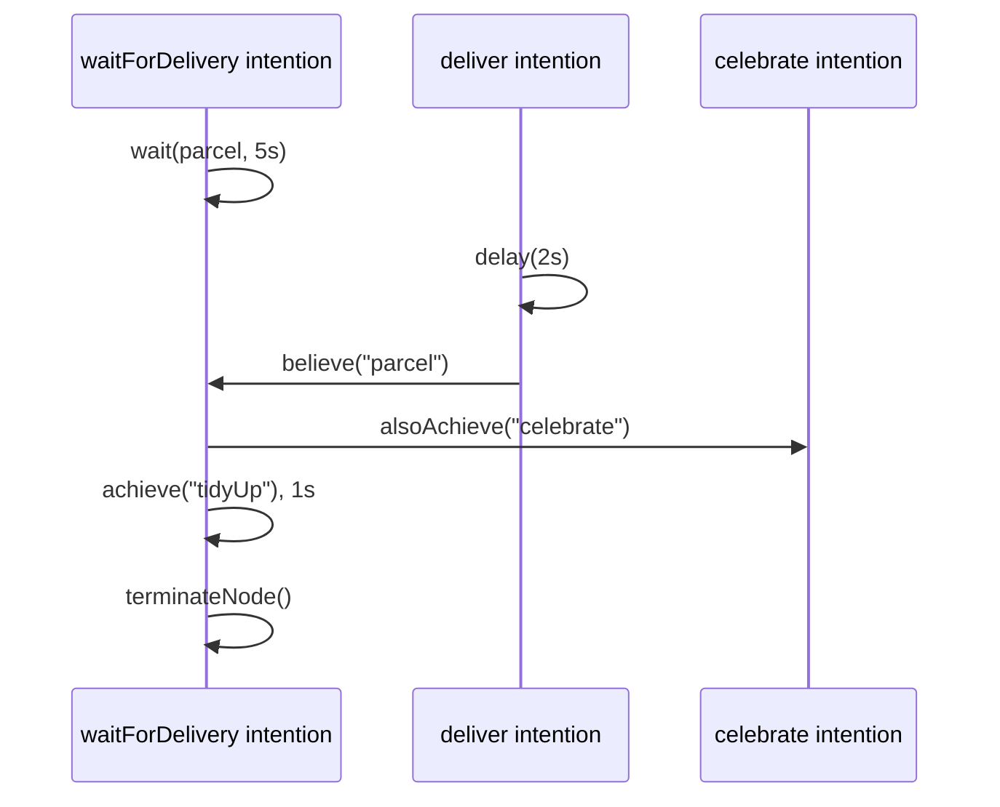

# Wait for events and use time

Plan bodies are `suspend` functions running on coroutines, so an intention can pause, for some time or until
something happens, without blocking the agent: its other intentions keep running meanwhile.
The complete program is the [`wait-for-events`](https://github.com/jakta-bdi/jakta/tree/main/examples/wait-for-events)
example; run it with `./gradlew :examples:wait-for-events:run`.

## Wait for some time

Use `delay` from `kotlinx.coroutines`:

```kotlin
} triggers {
    delay(1.seconds)
}
```

:::tip
In [Alchemist simulations](./alchemist.md), `delay` advances in **simulated** time.
:::

## Wait for an event

`agent.wait(filter, timeout)` suspends the intention until the agent receives an event for which `filter` returns
a non-null value, and returns that value; after `timeout`, it returns `null`.
The filter sees every event the agent handles: belief and goal events (`AgentEvent.Internal`), as well as incoming
messages and perceptions (`AgentEvent.External`).

```kotlin
private fun beliefAdded(expected: String): (AgentEvent) -> String? = { event ->
    (event as? AgentEvent.Internal.Belief.Add<*>)?.belief?.takeIf { it == expected } as String?
}
```

```kotlin
} triggers {
    val parcel = agent.wait(beliefAdded("parcel"), timeout = 5.seconds)
    if (parcel != null) agent.print("Parcel received!") else agent.print("Gave up waiting")
}
```

## Start a concurrent intention

`agent.alsoAchieve(goal)` starts a **new** intention for the goal and returns immediately:

```kotlin
agent.alsoAchieve("celebrate")
```

Every initial goal, and every plan triggered by an event, also runs in its own intention.

## Achieve a sub-goal

`agent.achieve(goal)` (from `it.unibo.jakta.agent.achieve`) runs the sub-goal in the **current** intention,
and returns when it is achieved:

```kotlin
agent.achieve("tidyUp")
agent.print("Tidied up")
```


```mermaid
sequenceDiagram
    participant W as waitForDelivery intention
    participant D as deliver intention
    participant C as celebrate intention
    W->>W: wait(parcel, 5s)
    D->>D: delay(2s)
    D->>W: believe("parcel")
    W->>C: alsoAchieve("celebrate")
    W->>W: achieve("tidyUp"), 1s
    W->>W: terminateNode()
```
