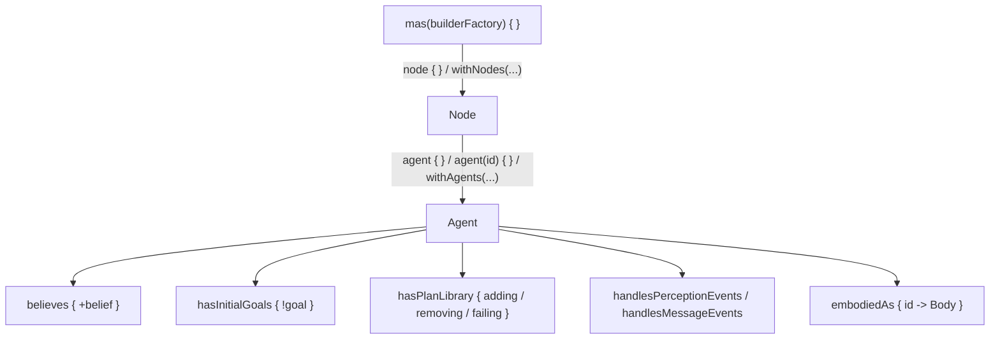
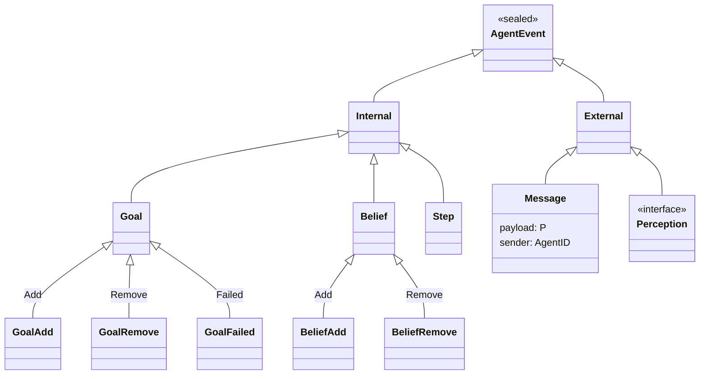

# DSL Reference

A complete list of the public DSL provided by `jakta-api`, `jakta-dsl` and `jakta-core`, independent of the
[incarnation](../explanation/incarnations/index.md). The generated [API docs](pathname:///api/index.html) have the full
signatures; this page shows what each element is for and where to import it from.

In the signatures below, `B`, `G` and `Body` are the belief, goal and body types, and `Ctx` is a plan's context type.

## Structure of a MAS



## Entry points

Package `it.unibo.jakta.dsl` (`jakta-core`).

| Function | Returns | Meaning |
|---|---|---|
| `mas(builderFactory) { ... }` | `MasBuilder` | Defines a multi-agent system. `builderFactory` creates the builder of each node, e.g. `NodeBuilders.baseNode()`. |
| `node(builderFactory) { ... }` | `ExecutableNode<Body>` | Defines a stand-alone node, to be combined with `withNodes(...)`. |
| `agent<B, G, Body> { ... }` | `(Node<Body>) -> AgentSpecification` | Defines an agent *factory* with a random `BaseAgentID`. The agent is built when added to a node. |
| `agent<B, G, Body>(id) { ... }` | `(Node<Body>) -> AgentSpecification` | As above, with an explicit `AgentID`. |
| `plans<B, G, Body> { node -> ... }` | `(Node<Body>) -> List<Plan>` | Defines a reusable list of plans, installed with `withPredefinedPlans(...)`. The lambda receives the node the agent lives in. |

Other entry-level utilities:

| Element | Package | Meaning |
|---|---|---|
| `NodeBuilders.baseNode<Body>()` | `it.unibo.jakta.dsl.node` | Builder factory for in-memory `BaseNode`s. |
| `MasBuilder.runLocally()` | `it.unibo.jakta.dsl.mas` | Suspending shortcut for `run(CoroutineNodeRunner(SharedMemoryNetwork()))`. |
| `BaseAgentID(name)` | `it.unibo.jakta.agent` | An agent identifier: `name` is the `displayName`, the identity is a random UUID (its `toString()`). Two `BaseAgentID("Bob")` are **different** agents. |

## MasBuilder

Package `it.unibo.jakta.dsl.mas`.

| Member | Meaning |
|---|---|
| `node { ... }` | Adds a node built with the MAS builder factory. The receiver is a `NodeBuilder`. |
| `withNodes(vararg nodes)` | Adds nodes built separately with `node(...) { }`. |
| `suspend run(runner: NodeRunner)` | Runs every node with `runner`, and returns when all nodes have terminated. |

## NodeBuilder

Package `it.unibo.jakta.dsl.node`.

| Member | Meaning |
|---|---|
| `node: Node<Body>` | The node being built. Use it to create node-bound skills, e.g. `MessagingSkill(node)`. |
| `agent<B, G> { ... }` / `agent<B, G>(id) { ... }` | Defines an agent living in this node. The receiver is an `AgentBuilder`. |
| `withAgents(vararg factories)` | Adds agents defined elsewhere with the top-level `agent { }`. |

## AgentBuilder

Package `it.unibo.jakta.dsl.agent`.

| Member | Meaning |
|---|---|
| `embodiedAs { id -> Body }` | **Required.** Creates the agent's body from its id. |
| `believes { +belief }` | Initial beliefs; `+` adds one. |
| `hasInitialGoals { !goal }` | Initial goals, pursued when the agent starts; `!` adds one. |
| `hasPlanLibrary { ... }` | The agent's plans. The receiver is a `PlanLibraryBuilder`. |
| `withPredefinedPlans(vararg plans)` | Adds plans created with `plans { node -> ... }`. |
| `handlesPerceptionEvents { perception -> AgentUpdate? }` | Maps perceptions to updates of the agent. By default perceptions are ignored. |
| `handlesMessageEvents { message -> AgentUpdate? }` | Maps received messages to updates of the agent. By default messages are discarded. |
| `addBelief(b)`, `addGoal(g)` | Programmatic alternatives to `believes` and `hasInitialGoals`. |
| `addBeliefPlan(plan)`, `addGoalPlan(plan)` | Adds an already-built plan. |
| `node: Node<Body>` | The node the agent will live in. |

The handlers run with the agent's `AgentState` as receiver, so they can read `beliefs`, `intentions`,
`beliefPlans` and `goalPlans`.

## Plans

Package `it.unibo.jakta.dsl.plan`. Inside `hasPlanLibrary { }` (a `PlanLibraryBuilder<B, G>`):

```kotlin
adding.goal { /* G.() -> Ctx? */ } onlyWhen { /* GuardScope<B, Ctx>.() -> Ctx? */ } triggers { /* body */ }
```

### Triggers

| Trigger | Relevant for |
|---|---|
| `adding.goal { }` | the addition of a goal (initial goals, `achieve`, `alsoAchieve`, `AgentUpdate.Goal` additions) |
| `removing.goal { }` | the removal of a goal (`AgentUpdate.Goal` removals) |
| `failing.goal { }` | the failure of a goal: no applicable plan, or the plan body threw an exception |
| `adding.belief { }` | the addition of a belief not already in the belief base |
| `removing.belief { }` | the removal of a belief that was in the belief base |

The trigger block receives the goal or belief as `this` and returns the plan **context** if the plan is relevant,
`null` otherwise. The type of the context is inferred from the block.

:::note
A goal removal only triggers `removing.goal` plans: intentions already pursuing that goal are not stopped.
:::

### Guards

`onlyWhen { }` is optional. It runs with a `GuardScope<B, Ctx>` receiver (package `it.unibo.jakta.plan`):

| Member | Meaning |
|---|---|
| `beliefs: Collection<B>` | A snapshot of the belief base. |
| `context: Ctx` | The context returned by the trigger. |

It returns the context for the body (usually `context`, possibly refined) or `null` if the plan is not applicable.
Without a guard, every relevant plan is applicable.

### Plan selection

When an event occurs, the plans of the matching kind are filtered by trigger (relevant) and then by guard
(applicable), and the **first** applicable plan in declaration order is executed.
If no plan is applicable for a goal addition, the goal fails. If none is applicable for a belief event,
the event is just logged.

### Body

`triggers { }` is a `suspend` lambda with a `PlanScope<B, G, Ctx>` receiver (package `it.unibo.jakta.plan`),
and the context is also available as a Kotlin context parameter. The value of its last expression is the
**result** of the plan, returned to whoever pursued the goal with `achieveWithResult`.

| Member | Meaning |
|---|---|
| `agent: MutableAgentState<B, G>` | The agent's state, see below. |
| `context: Ctx` | The context produced by the trigger and the guard. |
| `node` | Not a member of `PlanScope`: it is the `node` of the enclosing builder (or the parameter of `plans { node -> }`), captured by the lambda. |

Plus any [skill](../basic-concepts/skills.md) available in the enclosing `context(...)` blocks, reachable with
`contextOf<Skill>()` or through the skill's extension functions.

## Agent state

`MutableAgentState<B, G>` (package `it.unibo.jakta.agent`), available as `agent` in plan bodies.

| Member | Meaning |
|---|---|
| `id: AgentID` | The agent's identifier. |
| `beliefs: Collection<B>` | A snapshot of the belief base (a set: adding an existing belief generates no event). |
| `intentions: Set<Intention>` | The intentions currently executing. |
| `believe(b)` | Adds a belief, generating a belief-addition event if it was not present. |
| `forget(b)` | Removes a belief, generating a belief-removal event if it was present. |
| `suspend achieve(g)` | Pursues a sub-goal in the current intention and suspends until it is achieved. |
| `suspend achieveWithResult<R>(g): R` | As `achieve`, returning the result of the plan that achieved the goal. |
| `alsoAchieve(g)` | Pursues a goal in a new intention, without waiting for it. |
| `suspend wait(filter, timeout = null): T?` | Suspends until an event for which `filter` returns non-null happens, and returns that value, or `null` on timeout. |
| `print(message: String)` | Logs a message tagged with the agent's name. It is logged at the highest severity, so it survives `Logger.setMinSeverity(Severity.Assert)`. |
| `addPlan(plan)` | Adds a plan to the plan library at runtime. |
| `setPerceptionHandler { }`, `setMessageHandler { }` | Replaces the perception or message handler at runtime. |

`achieve` and `achieveWithResult` are extension functions: import `it.unibo.jakta.agent.achieve` and
`it.unibo.jakta.agent.achieveWithResult`.

For example, `wait` can suspend a plan until a belief appears:

```kotlin
adding.goal {
    takeIf { it == "waitForGo" }
} triggers {
    val go = agent.wait({ event ->
        (event as? AgentEvent.Internal.Belief.Add<*>)?.belief?.takeIf { it == "go" }
    }, timeout = 5.seconds)
    agent.print(if (go != null) "Go!" else "Timed out")
}
```

## Node

`Node<Body>` (package `it.unibo.jakta.node`), available as `node` in builders and plan bodies.

| Member | Meaning |
|---|---|
| `id: NodeID` | The node identifier. |
| `agents: Map<AgentID, Body>` | The agents currently in the node, with their bodies. |
| `publishEvent(event, filter = { true })` | Delivers an external event. A `Perception` is delivered to the agents of this node whose body satisfies `filter`. A `Message` is sent over the network, to the agents of every node whose body satisfies `filter`. |
| `addAgent(factory, nodeID = id)` | Adds an agent created with `agent { }`, by default to this node. |
| `removeAgent(id)` | Removes an agent. |
| `terminateNode(error = null, nodeID = id)` | Stops a node, by default this one, with all its agents. |
| `getAgentIDfromBody(body)` | The id of the agent with the given body. |

For instance, a perception for a single agent, found by its body:

```kotlin
node.publishEvent(Temperature(21)) { body -> body == node.agents[targetAgentId] }
```

## Events and updates

Package `it.unibo.jakta.event`.



| Type | Meaning |
|---|---|
| `AgentEvent.Internal.Goal.Add` / `.Remove` / `.Failed` | A goal was added, removed or failed. Has `goal`. |
| `AgentEvent.Internal.Belief.Add` / `.Remove` | A belief was added or removed. Has `belief`. |
| `AgentEvent.Internal.Step` | Scheduling of an intention (internal). |
| `AgentEvent.External.Message<P>(payload, sender)` | A message received from `sender`. |
| `AgentEvent.External.Perception` | Interface to implement for your own perceptions. |
| `AgentUpdate.Belief(additions, removals = emptySet())` | Returned by handlers: beliefs to add and remove. |
| `AgentUpdate.Goal(additions, removals = emptySet())` | Returned by handlers: goals to add and remove. |

When an update is applied, elements present both in `additions` and `removals` are ignored,
removals are applied first, and each change generates the corresponding internal event.

Custom perceptions are plain classes:

```kotlin
data class Temperature(val celsius: Int) : AgentEvent.External.Perception

handlesPerceptionEvents { perception ->
    when (perception) {
        is Temperature -> AgentUpdate.Belief(
            additions = setOf("temperature(${perception.celsius})"),
            removals = beliefs.filter { it.startsWith("temperature(") }.toSet(),
        )
        else -> null
    }
}
```

## Skills

Package `it.unibo.jakta.skills` (`jakta-core`). All skills extend `Skill<Body>(node)`.

| Skill | Functions | Meaning |
|---|---|---|
| `MessagingSkill(node)` | `Agent.sendTo(receiver, payload)` | Sends `payload` to the agent `receiver`, in any node. |
| | `Agent.broadcast(payload)` | Sends `payload` to every other agent, in any node. |
| `AgentTerminationSkill(node)` | `Agent.terminate()` | Removes the agent from the node. Also available with just a `context(node)` in scope. |
| `NodeTerminationSkill(node)` | `PlanScope.terminateNode()` | Stops the node. |

Skills are made available with `context(skill) { ... }` around agent or plan definitions, and the corresponding
functions must be imported (e.g. `it.unibo.jakta.skills.sendTo`).
The built-in skills take a `Node<Any>`, so they are meant for nodes built with `NodeBuilders.baseNode()` (body type `Any`).

```kotlin
node {
    context(MessagingSkill(node), NodeTerminationSkill(node)) {
        agent<String, String>(BaseAgentID("worker")) {
            embodiedAs { Any() }
            hasInitialGoals { !"work" }
            hasPlanLibrary {
                adding.goal {
                    takeIf { it == "work" }
                } triggers {
                    agent.broadcast("done")
                    terminateNode()
                }
            }
        }
    }
}
```

## Runners and networks

Package `it.unibo.jakta.node` (`jakta-core`).

| Type | Meaning |
|---|---|
| `NodeRunner<N>` | Executes nodes: `suspend run(node)`. |
| `CoroutineNodeRunner(network)` | Runs every agent of a node as a coroutine, stepping its reasoning cycle; each plan is a child coroutine. |
| `NodeNetwork` | Connects nodes, delivering system events (messages, agent additions and removals, shutdowns) among them. |
| `SharedMemoryNetwork()` | A `NodeNetwork` for nodes running in the same process. |

The Alchemist incarnation provides its own runtime, see [Simulate a MAS with Alchemist](../how-to/alchemist.md).
