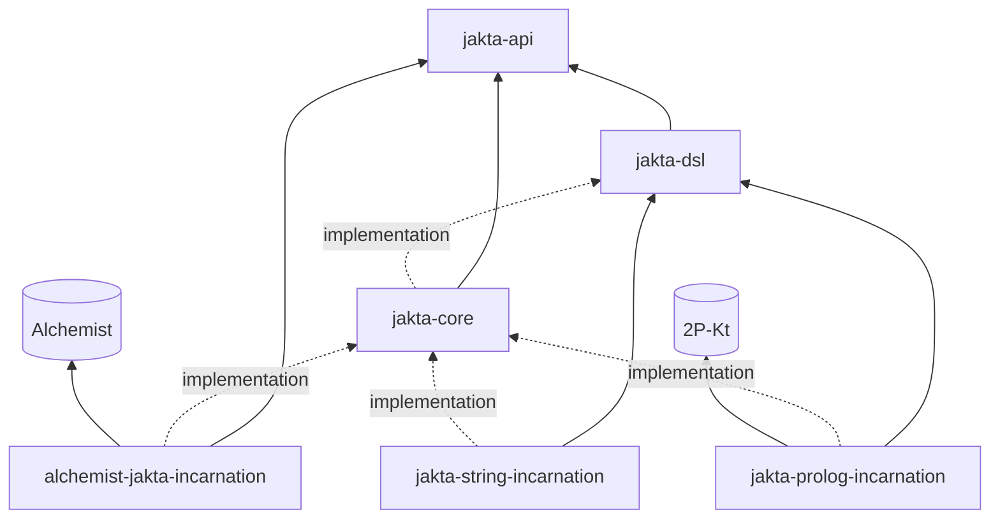

# Modules and Artifacts

JaKtA is a [Kotlin Multiplatform](https://kotlinlang.org/docs/multiplatform.html) monorepo.
All modules are published on Maven Central as `it.unibo.jakta:<module>:<version>`;
the multiplatform ones are also published on npm as `@jakta/<module>`.
The API reference for the latest release of every module is available under [API Docs](pathname:///api/index.html).



Solid arrows are `api` dependencies (exposed to your code), dashed ones are `implementation` dependencies —
which is why `jakta-core` must be declared explicitly next to an incarnation.

| Module | Content | Depends on | Platforms |
|---|---|---|---|
| `jakta-api` | Representation-agnostic contracts: `Agent`, `AgentID`, `AgentState`/`MutableAgentState`, events (`AgentEvent`, `AgentUpdate`), `Plan`, `PlanScope`, `GuardScope`, `Node`, `NodeRunner`. | — | JVM, JS, native |
| `jakta-dsl` | The DSL builder interfaces: `MasBuilder`, `NodeBuilder`, `AgentBuilder`, `PlanLibraryBuilder`, `PlanBuilder`, ... No implementation. | api | JVM, JS, native |
| `jakta-core` | The engine and the DSL entry points: `mas`, `node`, `agent`, `plans`, `NodeBuilders.baseNode()`, `runLocally()`, `CoroutineNodeRunner`, `SharedMemoryNetwork`, and the built-in [skills](../basic-concepts/skills.md). | api, dsl | JVM, JS, native |
| `jakta-prolog-incarnation` | Beliefs and goals as [2P-Kt](https://github.com/tuProlog/2p-kt) terms, `prologPlan`, unification-based matching, belief sources, KQML messaging. | api, dsl, core, 2P-Kt | JVM, JS |
| `jakta-string-incarnation` | Beliefs and goals as `String`s. | api, dsl, core | JVM, JS, native |
| `alchemist-jakta-incarnation` | Runs JaKtA nodes as [Alchemist](https://alchemistsimulator.github.io/) simulated devices. | api, dsl, core, Alchemist | JVM (17+) |

Native targets are Linux (x64, arm64), Windows (mingw x64), macOS (arm64) and iOS (arm64, x64).

## Which modules do I need?

An application needs `jakta-core` plus an [incarnation](../explanation/incarnations/index.md):

```kotlin
dependencies {
    implementation("it.unibo.jakta:jakta-core:<VERSION>")
    implementation("it.unibo.jakta:jakta-prolog-incarnation:<VERSION>")
}
```

The incarnations expose `jakta-api` and `jakta-dsl` transitively, but not `jakta-core`: declare it explicitly.
If you want to use your own belief and goal types, `jakta-core` alone is enough.

## Source layout

```
jakta/
├── jakta-api/                     # contracts
├── jakta-dsl/                     # DSL interfaces
├── jakta-core/                    # engine + DSL entry points
├── jakta-prolog-incarnation/
├── jakta-string-incarnation/
├── alchemist-jakta-incarnation/
├── examples/
│   ├── hello-world/
│   └── blocksworld/
└── website/                       # this website
```
