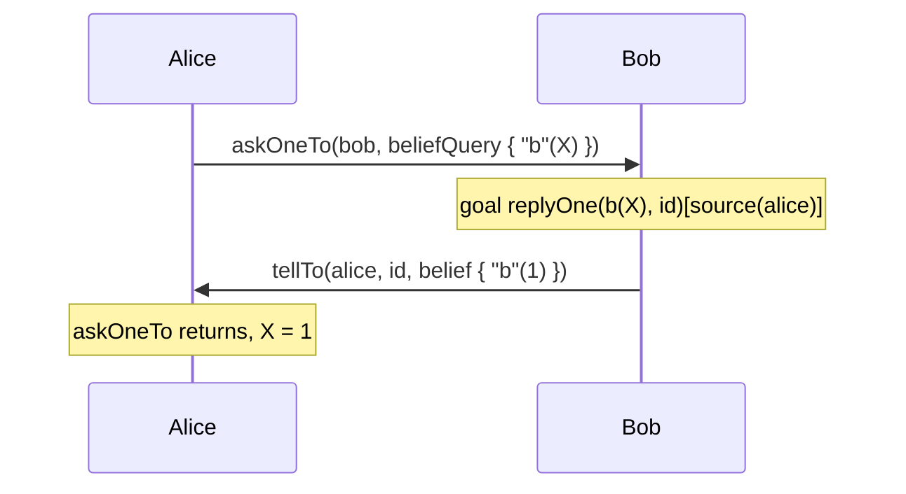

# Prolog Incarnation Reference

Everything provided by `jakta-prolog-incarnation`, where beliefs are [2P-Kt](https://github.com/tuProlog/2p-kt)
clauses and goals are 2P-Kt terms. For an introduction see [Incarnations](../explanation/incarnations/prolog/index.md).

## Types

| Type | Package | Meaning |
|---|---|---|
| `PrologBelief` | `it.unibo.jakta.dsl.belief` | Alias of 2P-Kt `Rule`: a fact (`Fact`) or an inference rule. |
| `PrologGoal` | `it.unibo.jakta.dsl.goal` | Alias of 2P-Kt `Struct`. |
| `JaktaLogicProgrammingScope` | `it.unibo.jakta.logic` | The 2P-Kt logic programming DSL (variables `A`..`Z`, operators, `impliedBy`, standard library, ...). All the builder blocks below run in it. |
| `MutableSubstitutionPlanContext` | `it.unibo.jakta.logic` | The context of Prolog plans: a `substitution` that guards and bodies can extend with `+=`. |

## Prolog plans

```kotlin
hasPlanLibrary {
    prologPlan {
        adding.goal { matchingGoal { "greet"(X) } } triggers { agent.print("Hello ", X) }
    }
}
```

`prologPlan { }` (import `it.unibo.jakta.logic.JaktaLogicProgrammingScope.Companion.prologPlan`) opens a
`JaktaLogicProgrammingScope` inside a plan library, so that the triggers, guards and bodies of the plans it contains
share the same logic variables. Each `prologPlan` has its own scope: `X` in two different `prologPlan` blocks are
different variables. A single block can contain several plans.

## Beliefs

Package `it.unibo.jakta.dsl.belief`.

| Function | Where | Meaning |
|---|---|---|
| `initialBelief { struct }` | anywhere | A fact. Must be ground. |
| `inferenceRule { head impliedBy body }` | anywhere | An inference rule. |
| `belief { struct }` | plan bodies | A fact with the current substitution applied. Must be ground after substitution. |
| `beliefQuery { struct }` | plan bodies | A query (may contain variables) with the current substitution applied. |
| `newContextBeliefQuery { struct }` | anywhere | A query built in a fresh scope. |
| `noSubstitutionBeliefQuery { struct }` | inside a logic scope | A query built in the current scope, without applying substitutions. |
| `PrologBelief.matchingBelief { query }` | belief triggers | Unifies the belief with `query`, annotations included (see [Annotations](#annotations)); returns the context or `null`. |
| `PrologBelief.matchBelief(query)` | anywhere | As `matchingBelief`, with an already-built query. |

```kotlin
believes {
    +initialBelief { "parent"("alice", "bob") }
    +initialBelief { "parent"("alice", "carol") }
    +inferenceRule { "sibling"(X, Y) impliedBy ("parent"(Z, X) and "parent"(Z, Y) and (X neq Y)) }
}
```

## Goals

Package `it.unibo.jakta.dsl.goal`.

| Function | Where | Meaning |
|---|---|---|
| `initialGoal { struct }` | anywhere | A goal. Must be ground. |
| `goal { struct }` | plan bodies | A goal with the current substitution applied. Must be ground after substitution. |
| `goalQuery { struct }` | inside a logic scope | A goal query (may contain variables). |
| `PrologGoal.matchingGoal { query }` | goal triggers | Unifies the goal with `query`, annotations included (see [Annotations](#annotations)); returns the context or `null`. |
| `replyOne(query, messageId = _)` | triggers | The goal added by an incoming `askOne`, see [KQML](#kqml). |
| `replyAllTo(query, messageId = _)` | triggers | The goal added by an incoming `askAll`, see [KQML](#kqml). |

Goals and beliefs must be predicates: a `Struct` whose functor is not a Prolog control construct (`,`, `;`, `:-`, ...).
An atom such as `Atom.of("start")` or `"start".toAtom()` is a valid goal.

## Guards and queries

| Function | Package | Where | Meaning |
|---|---|---|---|
| `satisfies { query }` | `it.unibo.jakta.dsl.plan` | guards | Solves `query` against the belief base (facts and rules) with the current substitution applied. On success merges the solution into the context and returns it, otherwise returns `null`. |
| `testQuery { query }` | `it.unibo.jakta.dsl.plan` | plan bodies | As `satisfies`, but throws (failing the plan) if the query has no solution. |
| `Collection<Rule>.unifiesWith(query)` | `it.unibo.jakta.logic` | anywhere | Solves `query` on a collection of clauses, e.g. `agent.beliefs`; returns the first 2P-Kt `Solution`. |
| `Collection<Rule>.allSolutionsOf(query)` | `it.unibo.jakta.logic` | anywhere | Returns all the solutions of `query`. |
| `Struct.annotatedMguWith(query)` | `it.unibo.jakta.logic` | anywhere | Most general unifier taking annotations into account. |

Queries are solved by a Prolog solver in which unknown predicates fail.

```kotlin
prologPlan {
    adding.goal {
        matchingGoal { "introduce"(X) }
    } onlyWhen {
        satisfies { "sibling"(X, Y) }
    } triggers {
        agent.print(X, " is the sibling of ", Y)
        testQuery { "parent"(P, X) }
        agent.print(X, " is the child of ", P)
    }
}
```

## Reading variables

| Function | Package | Meaning |
|---|---|---|
| `Var.value<T>()` | `it.unibo.jakta` | The Kotlin value bound to the variable in the current context. Throws if the variable is not bound or cannot be converted. |
| `MutableAgentState.print(vararg parts)` | `it.unibo.jakta` | Prints the concatenation of `parts`, replacing each variable with its value. |

`value<T>()` converts Prolog terms to Kotlin values: integers to `Int`, `Long`, `Double`, ...; reals to `Double`, `Float`, ...;
atoms to `String`; lists to `List<T>` or `Set<T>` (recursively); tuples and two-element lists to `Pair<A, B>`;
`true`/`false` to `Boolean`. Asking for a 2P-Kt type (e.g. `Term`, `Struct`) returns the term itself.

```kotlin
prologPlan {
    adding.goal {
        matchingGoal { "sum"(L) }
    } triggers {
        val numbers: List<Int> = L.value()
        agent.print("The sum of ", L, " is ", numbers.sum())
    }
}
```

## Annotations

Package `it.unibo.jakta`.

| Element | Meaning |
|---|---|
| `term[annotation, ...]` | Annotates a term, e.g. `"ping"(1)[source(X)]`. Import `it.unibo.jakta.get`. |
| `term.tag(annotation, ...)` | Same as `[...]`, as a function. |
| `source(agentId)`, `source("name")`, `source(term)` | The `source(...)` annotation. `source(agentId)` uses the id's `toString()`, i.e. its UUID for a `BaseAgentID`. |
| `self` | The atom `self`. |

Matching semantics. A term without annotations is treated as annotated with `[source(self)]`. Then:

- **beliefs** (`matchingBelief`, `satisfies`, `testQuery`): every annotation of the *query* must unify with a distinct
  annotation of the belief. A query without annotations matches regardless of the belief's annotations.
- **goals** (`matchingGoal`): the check is reversed, every annotation of the *goal* must unify with a distinct
  annotation of the query. A query without annotations only matches the agent's own goals.

So `matchingBelief { "ping"(N) }` matches both the agent's own beliefs and those told by others, while
`matchingBelief { "ping"(N)[source(self)] }` only matches the agent's own.
For goals delegated by other agents (with `delegateAchieveTo` or `sendUnachieveTo`), the trigger must mention the source:
`matchingGoal { "job"(N)[source(S)] }`.

## KQML

Package `it.unibo.jakta.kqml`. Sending requires a [`MessagingSkill`](./dsl.md#skills) in scope;
receiving requires delegating message handling to `handleKQMLPayload`:

```kotlin
handlesMessageEvents {
    when (val payload = it.payload) {
        is KQMLPayload -> handleKQMLPayload(payload, it.sender)
        else -> null
    }
}
```

### Performatives

| Sender | Payload | Receiver update |
|---|---|---|
| `agent.tellTo(receiver, vararg beliefs)` | `Tell(beliefs)` | Adds each belief, annotated with `[source(sender)]`. Beliefs must be ground facts. |
| `agent.broadcastTell(vararg beliefs)` | `Tell` | As above, for every other agent. |
| `agent.untellTo(receiver, query)` | `Untell(query)` | Removes the beliefs matching `query[source(sender)]`, i.e. only those told by the sender. |
| `agent.broadcastUntell(query)` | `Untell` | As above, for every other agent. |
| `agent.delegateAchieveTo(receiver, goal)` | `Achieve(goal)` | Adds the goal `goal[source(sender)]`. The goal must be ground. |
| `agent.broadcastAchieve(goal)` | `Achieve` | As above, for every other agent. |
| `agent.sendUnachieveTo(receiver, query)` | `Unachieve(query)` | Removes the goal `query[source(sender)]`, triggering `removing.goal` plans. It does not stop intentions already pursuing it. |
| `agent.broadcastUnachieve(query)` | `Unachieve` | As above, for every other agent. |
| `agent.askOneTo(receiver, query, timeout = null)` | `AskOne(query)` | Adds the goal `replyOne(query, id)[source(sender)]`. |
| `agent.askAllTo(receiver, query, timeout = null)` | see caution below | |
| `agent.tellTo(receiver, replyingTo, vararg beliefs)` | `Tell(beliefs, replyingTo)` | A tell that answers the question with id `replyingTo`. |

Every payload has a unique `id`.

### Asking and replying

`askOneTo` is a `suspend` function that must be called in a Prolog plan body:

1. it sends `AskOne(query)` and suspends until a `Tell` replying to that question arrives from `receiver`,
   or until `timeout` expires;
2. it returns `null` on timeout; otherwise it unifies the first told belief with `query`, merges the result into the
   plan context (so the query variables become bound) and returns the substitution — which is a *failed* substitution
   if the reply does not unify with the query.

Questions are not answered automatically: the receiver must have a plan for `replyOne` goals, which answers with the
question id.



```kotlin
// Alice
prologPlan {
    adding.goal {
        matchingGoal { Atom.of("ask") }
    } triggers {
        val reply = agent.askOneTo(bob, beliefQuery { "b"(X) }, timeout = 5.seconds)
        if (reply != null && reply.isSuccess) {
            agent.print("Bob believes b(", X, ")")
        }
    }
}

// Bob
prologPlan {
    adding.goal {
        matchingGoal { replyOne(Q, M)[source(S)] }
    } triggers {
        when (val solution = agent.beliefs.unifiesWith(Q.value())) {
            is Solution.Yes -> agent.tellTo(
                BaseAgentID(id = S.value()),
                M.value<String>(),
                Fact.of(solution.solvedQuery),
            )
            else -> agent.print("I don't know")
        }
    }
}
```

`BaseAgentID(id = S.value())` rebuilds the sender's identifier from the source annotation, since `source(agentId)`
stores the id's UUID.

:::caution[`askAllTo`]
In the current release `askAllTo` sends an `AskOne` payload instead of an `AskAll`
(see [`KQMLMessaging.kt`](https://github.com/jakta-bdi/jakta/blob/main/jakta-prolog-incarnation/src/commonMain/kotlin/it/unibo/jakta/kqml/KQMLMessaging.kt)),
so the receiver gets a `replyOne` goal rather than a `replyAllTo` one. Prefer `askOneTo`, or answer `replyOne` goals
with a `Tell` containing all the solutions.
:::
