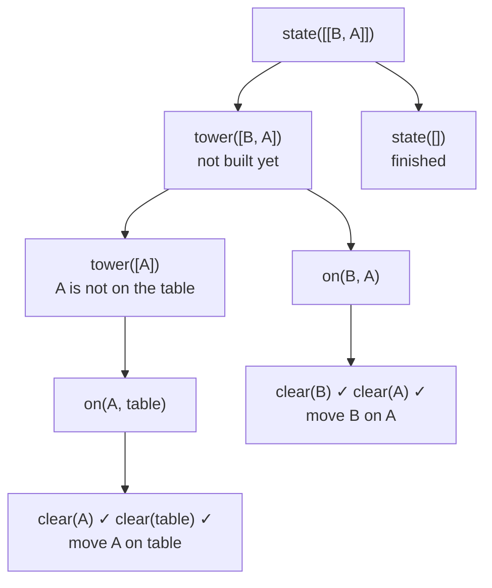

# Blocks World

import ExampleApp from '@site/src/components/ExampleApp/ExampleApp';

The [blocksworld example](https://github.com/jakta-bdi/jakta/tree/main/examples/blocksworld) is the classic
blocks-world planner, ported from the Jason agent of the same name: an agent rearranges stacks of blocks until they
match a goal configuration.

Drag the blocks to set the goal (shown first) and the starting world, then let the agent work.
It stops by itself when it is done, or gives up through a failure plan.

It runs below, right in your browser: the *agent trace* on the right shows what the agents print while they reason.

<ExampleApp name="blocksworld" title="Blocks World" />

```bash
./gradlew :examples:blocksworld:run                     # desktop
./gradlew :examples:blocksworld:jsBrowserDevelopmentRun # browser
```

## Why it matters

The agent is never told *how* to reach the goal configuration. It has a handful of small plans, each knowing how to
achieve one kind of goal, and it **plans recursively**: to achieve a goal, a plan adopts simpler sub-goals, whose
plans adopt simpler sub-goals still, down to single moves. Which plan handles a goal depends on what the agent
believes about the world *right now*. This is how BDI agents solve problems: hierarchical decomposition of goals
into sub-goals, chosen by context, instead of searching a plan up front.

The [complete agent](https://github.com/jakta-bdi/jakta/blob/main/examples/blocksworld/src/commonMain/kotlin/Agent.kt)
is about a dozen plans. Each one below is a `prologPlan { }` in its `hasPlanLibrary { }`.

### Recursive sub-goals

The desired configuration is a goal `state/1` holding a list of towers, each listed **top first**: for instance
`state([['A', 'B'], ['C']])` means `A` on `B`, and `C` alone on the table (block atoms are quoted, as they start with
an uppercase letter). The agent builds the towers one at a time, recursing on the rest of the list:

```kotlin
adding.goal {
    matchingGoal { state(emptyLogicList) }
} triggers {
    agent.print("Finished! Final state reached.")
    node.terminateNode()
}

adding.goal {
    matchingGoal { state(logicList(H, tail = T)) }
} triggers {
    agent.print("Building the tower ", H)
    agent.achieve(goal { tower(H) })
    agent.achieve(goal { state(T) })
}
```

A tower is built bottom-up, recursing on the tower below its top block:

```kotlin
adding.goal {
    matchingGoal { tower(logicListOf(X)) }
} triggers {
    agent.achieve(goal { on(X, table) })
}

adding.goal {
    matchingGoal { tower(logicList(X, Y, tail = T)) }
} triggers {
    agent.achieve(goal { tower(logicList(Y, tail = T)) })
    agent.achieve(goal { on(X, Y) })
}
```

`agent.achieve` suspends the plan until the sub-goal is achieved, so sub-goals run in order, and `goal { }`
substitutes the variables the trigger bound (`H`, `T`, `X`, `Y`). The recursion bottoms out in `on(X, Y)`, which
clears both blocks and finally acts on the world through the agent's skill:

```kotlin
adding.goal {
    matchingGoal { on(X, Y) }
} triggers {
    agent.achieve(goal { clear(X) })
    agent.achieve(goal { clear(Y) })
    agent.print("Moving block ", X, " on ", Y)
    blocksWorld.move(X.value(), Y.value())
}
```

### Plan selection by context

Several plans can be **relevant** for the same goal: JaKtA runs the **first applicable** one in the library, the
first whose guard holds. Each kind of goal therefore starts with an "already done" plan, guarded by a query on the
agent's beliefs:

```kotlin
adding.goal {
    matchingGoal { tower(T) }
} onlyWhen {
    satisfies { tower(T) }
} triggers {
    agent.print("Tower ", T, " is already built.")
}
```

`tower(T)` is not something the agent perceives. It only perceives `on(Block, Support)` facts, and **inference rules**
derive the rest:

```kotlin
believes {
    +initialBelief { clear(table) }
    +inferenceRule { clear(X) impliedBy not(on(`_`, X)) }
    +inferenceRule { tower(logicListOf(X)) impliedBy on(X, table) }
    +inferenceRule {
        tower(logicList(X, Y, tail = T)) impliedBy (on(X, Y) and tower(logicList(Y, tail = T)))
    }
}
```

So the same goal is handled differently depending on the world: a tower already in place costs nothing, and only
the missing parts get built. Guards can also *compute* the context of a plan. To clear a block, the agent looks for
a tower `[H | T]` with the block somewhere in `T`, which binds `H` to a block above it:

```kotlin
adding.goal {
    matchingGoal { clear(X) }
} onlyWhen {
    satisfies { tower(logicList(H, tail = T)) and member(X, T) }
} triggers {
    agent.achieve(goal { clear(H) })
    agent.print("Moving block ", H, " on ", table)
    blocksWorld.move(H.value(), table.value)
    agent.achieve(goal { clear(X) })
}
```

The plan moves `H` away and then **re-posts** `clear(X)`: while blocks are left above `X`, the same plan applies
again, until the "already clear" plan's guard succeeds.

### Giving up gracefully

Not every goal is reachable. When a sub-goal has no applicable plan, it fails, and the failure propagates up through
the plans waiting on it. A **failure plan** on the top-level goal catches it:

```kotlin
adding.goal {
    matchingGoal { start }
} triggers {
    blocksWorld.join()
    agent.achieve(desiredWorldState)
}

failing.goal {
    matchingGoal { start }
} triggers {
    agent.print("I could not reach the goal, giving up.")
    node.terminateNode()
}
```

See [Plans](../explanation/basic-concepts/plans.md) and [Failure handling](../explanation/execution-model.md#failure-handling)
for how relevance, applicability and failure work in general.

## A goal, step by step

Take a world where `A` is on `B`, and a goal asking for the opposite tower, `B` on `A`: `state([['B', 'A']])`.



1. `state([[B, A]])` adopts `tower([B, A])`, then `state([])`.
2. `tower([B, A])` is not provable, so the "already built" plan does not apply: the agent adopts `tower([A])`,
   then `on(B, A)`.
3. `tower([A])` is not provable either, since `A` is on `B`: the agent adopts `on(A, table)`, clears both sides
   (both already clear) and moves `A` to the table.
4. Back in `tower([B, A])`, `on(B, A)` finds `B` and `A` clear and moves `B` on `A`.
5. `state([])` is reached: the agent stops its node.

The trace panel shows exactly this sequence, in the agent's own words.

## The world, the skill and the perceptions

The world model,
[`model/BlocksWorld.kt`](https://github.com/jakta-bdi/jakta/blob/main/examples/blocksworld/src/commonMain/kotlin/model/BlocksWorld.kt),
is plain Kotlin and knows nothing about agents: it keeps the stacks in a `StateFlow`, which the UI observes to draw
them. The agent acts on it through a **skill**,
[`BlocksWorldSkills.kt`](https://github.com/jakta-bdi/jakta/blob/main/examples/blocksworld/src/commonMain/kotlin/BlocksWorldSkills.kt):
`join()` shows the current world to the agent, and `move(block, destination)` moves a block, then publishes the new
state as a perception. Plan bodies reach the skill as `blocksWorld`, a property only available where the skill is in
context:

```kotlin
context(skills: BlocksWorldSkills)
val PlanScope<*, *, *>.blocksWorld
    get() = skills
```

Each perception is turned into `on/2` facts that **replace** the previous ones; facts that did not change generate
no events, so plans only react to what moved:

```kotlin
fun handleBlocksWorldPerceptions(
    event: BlocksWorldPerception,
    previousBeliefs: Collection<PrologBelief>,
): AgentUpdate<*> = AgentUpdate.Belief(
    event.state.toPrologFacts(),
    previousBeliefs.filter { it.matchBelief(filterQuery) != null }.toSet(),
)
```

The UI,
[`ui/BlocksWorldAppState.kt`](https://github.com/jakta-bdi/jakta/blob/main/examples/blocksworld/src/commonMain/kotlin/ui/BlocksWorldAppState.kt),
builds the `state/1` goal from the arrangement you drag in the goal area, and runs the MAS in a coroutine when you
press **Play**: shuffling the world while the agent works simply cancels it.

## Things to try

- Drag blocks to change the goal or the world, or press **Shuffle**, then **Play** again.
- Swap the order of the two `on(X, Y)` plans: the unguarded one is now always selected first,
  and the agent tries to move blocks that are already in place.
- Add a `removing.belief { matchingBelief { on(X, Y) } }` plan that prints every `on/2` fact the agent stops believing.
