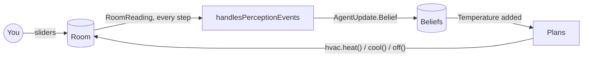

# Advanced: Thermostat

import ExampleApp from '@site/src/components/ExampleApp/ExampleApp';

This tutorial builds a thermostat agent that keeps a room at a target temperature while the room keeps changing:
it loses heat towards the outside, and you can open the window (drag the room temperature), change the target, or
make the day colder or warmer at any time. Along the way it shows how to:

- model an **environment** in plain Kotlin, with its own dynamics;
- let agents **perceive** it, turning perceptions into beliefs;
- let agents **act** on it through a skill;
- choose between plans with **guards** over the agent's beliefs.

Like the previous tutorials it only needs `jakta-core`: beliefs are plain Kotlin types, no Prolog involved.
The complete program is the [`thermostat`](https://github.com/jakta-bdi/jakta/tree/main/examples/thermostat) example,
and it runs right here in your browser:

<ExampleApp name="thermostat" title="Thermostat" />

```bash
./gradlew :examples:thermostat:run                     # desktop
./gradlew :examples:thermostat:jsBrowserDevelopmentRun # browser
```



## 1. Model the environment

JaKtA has no environment class to extend: the environment is your own Kotlin model. The room has a temperature,
the target set on the thermostat, the temperature outside, and a heating and cooling system:

<details>
<summary>Imports of <code>Room.kt</code></summary>

```kotlin
import it.unibo.jakta.event.AgentEvent.External.Perception
import it.unibo.jakta.node.Node
import kotlin.time.Duration
import kotlinx.coroutines.delay
import kotlinx.coroutines.flow.MutableStateFlow
import kotlinx.coroutines.flow.StateFlow
import kotlinx.coroutines.flow.asStateFlow
import kotlinx.coroutines.flow.update
```

</details>

```kotlin
private const val INSULATION_LOSS = 0.02
private const val POWER = 0.4

enum class Mode(val power: Double) {
    OFF(0.0),
    HEATING(POWER),
    COOLING(-POWER),
}

data class RoomState(val temperature: Double, val target: Double, val outside: Double, val mode: Mode = Mode.OFF)

class Room(initial: RoomState) {
    private val mutableState = MutableStateFlow(initial)
    val state: StateFlow<RoomState> = mutableState.asStateFlow()

    fun setTemperature(degrees: Double) = mutableState.update { it.copy(temperature = degrees) }
    fun setTarget(degrees: Double) = mutableState.update { it.copy(target = degrees) }
    fun setOutside(degrees: Double) = mutableState.update { it.copy(outside = degrees) }
    fun switch(mode: Mode) = mutableState.update { it.copy(mode = mode) }

    fun step() = mutableState.update {
        it.copy(temperature = it.temperature + (it.outside - it.temperature) * INSULATION_LOSS + it.mode.power)
    }
}
```

At each `step` the room drifts towards the outside temperature, and the system adds or removes some heat.
The state is a `StateFlow`, so the UI can observe it, and the sliders call the setters: the room changes whether
the agent likes it or not.

## 2. Perceive it

A **perception** is any class implementing `AgentEvent.External.Perception`. The thermostat perceives what its
display shows:

```kotlin
data class RoomReading(val temperature: Double, val target: Double, val mode: Mode) : Perception

suspend fun Room.simulate(node: Node<*>, stepTime: Duration) {
    while (true) {
        delay(stepTime)
        step()
        val state = state.value
        node.publishEvent(RoomReading(state.temperature, state.target, state.mode))
    }
}
```

`simulate` lets time pass and, after every step, publishes a reading on the node: every agent of the node receives
it. The agent never polls the room; the environment tells it what changed.

## 3. Act on it

What an agent can do on the environment is a **skill**: here, switching the heating and cooling system.

```kotlin
class Hvac(private val room: Room) {
    fun heat() = room.switch(Mode.HEATING)
    fun cool() = room.switch(Mode.COOLING)
    fun off() = room.switch(Mode.OFF)
}
```

A skill is an ordinary object. The [ping-pong tutorial](./ping-pong.md) gave agents `MessagingSkill` through a
`context(...)` block; a skill used by a single agent can also simply be passed to it, as below.
See [Skills](../explanation/basic-concepts/skills.md).

## 4. Turn perceptions into beliefs

The agent decides what a perception means to it. Its beliefs are a small sealed hierarchy:

<details>
<summary>Imports of <code>Thermostat.kt</code></summary>

```kotlin
import it.unibo.jakta.agent.BaseAgentID
import it.unibo.jakta.dsl.agent
import it.unibo.jakta.dsl.mas
import it.unibo.jakta.dsl.node
import it.unibo.jakta.dsl.node.NodeBuilders
import it.unibo.jakta.dsl.plan.triggers
import it.unibo.jakta.event.AgentUpdate
import it.unibo.jakta.node.CoroutineNodeRunner
import it.unibo.jakta.node.SharedMemoryNetwork
import kotlin.math.roundToInt
import kotlin.time.Duration
import kotlinx.coroutines.coroutineScope
import kotlinx.coroutines.launch
```

</details>

```kotlin
private const val TOLERANCE = 0.5

sealed interface RoomBelief

data class Temperature(val degrees: Double) : RoomBelief

data class Target(val degrees: Double) : RoomBelief

data class Running(val mode: Mode) : RoomBelief

private val Collection<RoomBelief>.target get() = filterIsInstance<Target>().single().degrees
private val Collection<RoomBelief>.mode get() = filterIsInstance<Running>().single().mode

private fun Double.roundedToTenths() = (this * 10).roundToInt() / 10.0
```

`handlesPerceptionEvents` turns each reading into an `AgentUpdate.Belief(additions, removals)`:

```kotlin
fun thermostat(hvac: Hvac) = agent<RoomBelief, String, Any>(BaseAgentID("thermostat")) {
    embodiedAs { Any() }
    handlesPerceptionEvents { perception ->
        when (perception) {
            is RoomReading -> {
                val readings = setOf(
                    Temperature(perception.temperature.roundedToTenths()),
                    Target(perception.target),
                    Running(perception.mode),
                )
                AgentUpdate.Belief(readings - beliefs.toSet(), beliefs.toSet() - readings)
            }

            else -> null
        }
    }
    // the plans, below
}
```

Only what changed is added or removed: a reading with the same target and mode only replaces the temperature, and
generates a single *belief addition* event, for the new `Temperature`. Rounding to tenths of a degree keeps the
agent from reacting to differences no thermostat would display.

## 5. Choose what to do with guards

The agent has no goals: it is purely reactive. Every new `Temperature` belief triggers three plans, and their
**guards** — `onlyWhen { }`, which sees the agent's `beliefs` and the trigger's `context` — decide which one applies:

```kotlin
hasPlanLibrary {
    adding.belief {
        this as? Temperature
    } onlyWhen {
        context.takeIf { it.degrees < beliefs.target - TOLERANCE && beliefs.mode != Mode.HEATING }
    } triggers {
        agent.print("It's ${context.degrees}°C, heating up to ${agent.beliefs.target}°C")
        hvac.heat()
    }
    adding.belief {
        this as? Temperature
    } onlyWhen {
        context.takeIf { it.degrees > beliefs.target + TOLERANCE && beliefs.mode != Mode.COOLING }
    } triggers {
        agent.print("It's ${context.degrees}°C, cooling down to ${agent.beliefs.target}°C")
        hvac.cool()
    }
    adding.belief {
        this as? Temperature
    } onlyWhen {
        val reached = when (beliefs.mode) {
            Mode.HEATING -> context.degrees >= beliefs.target
            Mode.COOLING -> context.degrees <= beliefs.target
            Mode.OFF -> false
        }
        context.takeIf { reached }
    } triggers {
        agent.print("It's ${context.degrees}°C, switching off")
        hvac.off()
    }
}
```

- The **trigger** `this as? Temperature` makes a plan relevant to temperature changes, and passes the new
  temperature on as the plan's `context`.
- The **guard** returns the context when the plan is applicable in the current situation, or `null` otherwise.
  When no guard holds, nothing happens: the temperature is fine, or the system is already doing the right thing.
- Heating starts below `target - TOLERANCE` but stops only at the target, so the thermostat does not switch on and
  off at every tenth of a degree.

## 6. Run it

The room and the agent run side by side: `simulate` drives the environment, the MAS runs the agent.

```kotlin
suspend fun runThermostat(room: Room, stepTime: Duration): Unit = coroutineScope {
    val home = node(NodeBuilders.baseNode()) {
        withAgents(thermostat(Hvac(room)))
    }
    launch { room.simulate(home, stepTime) }
    mas(NodeBuilders.baseNode()) {
        withNodes(home)
    }.run(CoroutineNodeRunner(SharedMemoryNetwork()))
}
```

The node is built on its own with `node(...)`, so that `simulate` can publish perceptions on it, and then added to
the MAS with `withNodes`. Neither the room nor the agent ever stops: cancelling the coroutine stops both.

The UI ([`ui/ThermostatApp.kt`](https://github.com/jakta-bdi/jakta/blob/main/examples/thermostat/src/commonMain/kotlin/ui/ThermostatApp.kt))
starts it in a `LaunchedEffect` when it is shown, draws the room from `room.state`, and adds an *agent trace* of
what the thermostat prints.

## Things to try

- Drag the room temperature below the target: the agent starts heating; above it, cooling.
- Set the outside to -10 °C: the heating cannot keep up, and the agent keeps heating at full power.
- Add a `Mode.ECO` with less power, and a plan that uses it when the temperature is only slightly low.
- Add a second room with its own thermostat on the same node: both receive every reading, so give `RoomReading` a
  room name and let each agent ignore the other room's readings.

## Going further

- [Connect agents to an environment](../how-to/connect-environment.md) and [Give agents a body](../how-to/custom-body.md)
  collect the patterns of this tutorial.
- The [showcase](../showcase/vacuum-world.md) runs larger agents written with the
  [Prolog incarnation](../explanation/incarnations/prolog/index.md), where beliefs are logic terms and plans
  are selected by unification.
